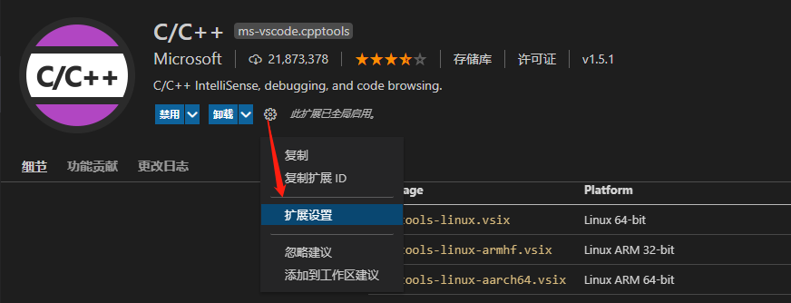
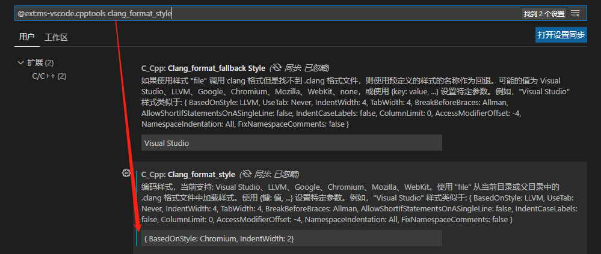

## 参考资料
- github上面fork的leetcode教程
  - [代码随想录](https://github.com/youngyangyang04/leetcode-master)
  - [动画题解](https://github.com/bayidatianshi/LeetCodeAnimation)
- [算法可视化](https://www.jianshu.com/p/fd4caf4ab727)
  - [推荐电子讲座模式](https://visualgo.net/zh/sorting)
  - https://algorithm-visualizer.org/
  - https://www.cs.usfca.edu/~galles/visualization/Algorithms.html

## 学习方法
- 多想多做
- 简单清晰的逻辑思路，例如文字伪代码
- 形象的表达方式，例如动图

## 环境准备：VSCODE编辑器配置C/C++编译器 ##

### Windows ###
- 安装MinGW编译器

```markup
链接：https://pan.baidu.com/s/1XwGjgZEVpzZ28g4ed990YA 
提取码：n858
```

- 解压编译器到不含空格与中文的路径，得到bin目录，例如：`D:\work20210625\CPP\mingw64\bin`
- 配置系统环境变量path，新建，输入上面的bin目录。此时cmd输入`g++ -v`输出版本信息则配置成功。
- 新建一个文件夹用来存放C++项目，例如`cpp_test`，并将下面的hello.cpp放入该文件夹

```cpp
#include <iostream>
using namespace std;

int main()
{
  char a = '!';
  cout << "Hello World" << a;
  return 0;
}
```

- VSCODE打开`cpp_test`文件夹，安装`C/C++`扩展，等待右下角进度安装完成，重启VSCODE
- 按快捷键Ctrl+Shift+P调出命令面板，输入C/C++，选择“Edit Configurations(UI)”配置编译器。

```markup
编译器路径：之前的bin目录，例如：D:\work20210625\CPP\mingw64\bin
IntelliSense 模式：gcc-x64
配置完成后生成.vscode文件夹，并且里面有一个c_cpp_properties.json文件
```

- 按快捷键Ctrl+Shift+D调出运行和调试面板，创建launch.json文件 -> C++(GDB/LLDB) -> gcc.exe，生成launch.json文件
- 通过点击运行和调试面板左上角的三角形进行运行和调试，例如给`cout << "Hello World" << a;`打上断点，点击三角形进行调试，然后能在左边的面板看到变量a实时的值。
- 去掉断点，点击三角形运行，终端会输出`Hello World!`，同时生成hello.exe
- 可以把上述已经配置好的cpp_test文件夹作为模板，复制到之后的cpp项目里，就不需要重复配置VSCODE了
- 代码格式化设置：VSCODE里按下shift + alt + f 可以格式化代码，默认花括号换行，可以通过修改C/C++扩展里面clang_format_style为{ BasedOnStyle: Chromium, IndentWidth: 2}改成花括号不换行




