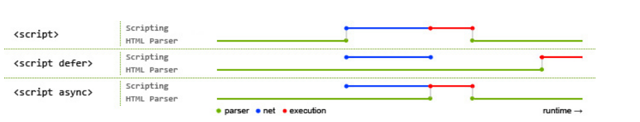
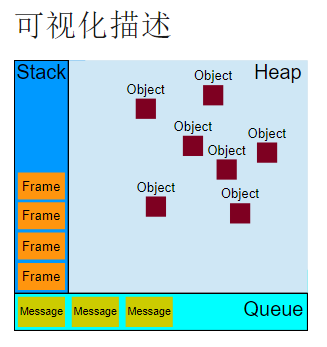

## JS参考教程
- [MDN的JS教程](https://developer.mozilla.org/zh-CN/docs/Web/JavaScript)
- [MDN的JS参考](https://developer.mozilla.org/zh-CN/docs/Web/JavaScript/Reference)
- [网道的JS教程](https://wangdoc.com/javascript/)
## 基础
### 注意点

### 模板
```javascript
<!DOCTYPE html>
<html>
<head>
  <meta charset="utf-8">
  <title>test</title>
</head>
<body>
<button onclick="fun1()">点击触发函数</button>
<p id="para1"></p>

<script type="text/javascript">
  function fun1() {
    const para1 = document.querySelector("#para1");
    para1.innerHTML = para1.innerHTML === "Hello World" ? [] : "Hello World";
  }
</script>
</body>
</html>
```

### 数据类型、类型判断、类型转换
#### 数据类型
- Boolean（布尔）：假值（false、0、空字符串（""）、NaN、null 和 undefined）
- Number（数字）：0 、 NaN
- String（字符串）
- Object（对象）：Function（函数）、Array（数组）、Date（日期）、RegExp（正则表达式）
- Symbol（符号）
- null（空）
- undefined（未定义）【声明了一个变量却没有对其赋值，那么这个变量的类型就是 undefined】
- Error（内置的错误类型）

#### 类型判断
- （实用）Object.prototype.toString.call(data) // 可输出基础类型[object Number]，也可以输出内置对象[object Array]，但不能输出自定义对象[object Object]
- （万能）let showType = (data) => data.constructor.name;
- （简易）console.log(typeof data); // 可输出基础类型:number \ string \ object（注意函数会输出function而不是object）等
- （实例）console.log(jack instanceof Person);  // 判断变量是否属于某个对象的实例，内置或自定义对象都支持

#### 类型转换
- Number(str)
- String(num)、+类型转换：数字与字符串相加会转换为字符串，且要注意计算的顺序【"3" + 4 + 5 等于 "345" ;   3 + 4 + "5" 等于 "75"】    
- String(arr)
- arr.join(',')
- let jsonStr = JSON.stringify(obj); let objFromJson = JSON.parse(jsonStr);

### 字符串
- 注意要区分以下变量类型的方法是否会改变原样，不改变原样的方法需要把返回值赋予一个新的变量，例如：var new = old.slice();
- 可以像数组一样访问某个字符：`let str1_0 = str1[0];`
- 可以像数组一样获取长度：`let len = str1.length;`
- 增：大多情况直接用+即可；特定字串前后增加则用修改的方法；特定位置的增加，str.slice(0,index) + " new content " + str.slice(index);
- 删：特定字串前后删除则用修改的方法；特定位置的删除，str.slice(0,index) + str.slice(index + 1);
- 查：
  - str.indexOf("Roboot")或str.search(/Rob.t/)，都是返回字符串中第一匹配子串的索引值，否则返回 -1 
  - var str_match = str1.match(/Rob.t/) //只会匹配一次，返回数组第一匹配子串、匹配子串的index和input原文
  - var str_match_g = str1.match(/Rob.t/g) //匹配多次，返回的数组就是所有找到的子串 即["Robot", "Robot", "RobOt"]
- 改：let str_repalce = str.replace("Robot", "Human")，仅仅修改第一次匹配的结果。第一参数支持正则，可用g修饰符实现全匹配。
- 截取字符串：slice(开始位置,不会包含进去的结束位置) ；支持负数（-1指倒数第一个）【var newStr = str.slice(-2, -1)】；省略参数就截取全部，用来实现复制
- 拆分字符串：将字符串划分成子串，返回包含子串的数组。【var str_arr = str1.split(" ")】
- 去空格：trim()去左右所有空格;去左空格trimStart();去右空格trimEnd()【str.trim()】
- 转换大小写：toLowerCase/toUpperCase【radData.toUpperCase();】
- *localeCompare()：返回一个数字表示是否引用字符串在排序中位于比较字符串的前面，后面，或者二者相同
- *padEnd() / padStart() ：在当前字符串尾部或首部填充指定的字符串， 直到达到指定的长度。 返回一个新的字符串。
- 剩余方法或操作请通过上述知识进行组合实现，或借助第三方库

### 数组
- 注意其中的箭头函数，函数体有多行的话要用大括号并且return
- 数组的方法比字符串更加丰富，所以先Array.from(str)把字符串变成数组，再进行各种操作。这是一种技巧
- 可以通过Array()进行创建：var arr = Array(10).fill(null);
- 遍历：array.forEach((item, index, array) => { console.log(item, index); }); // 万用，可利用遍历实现映射和过滤
- 映射：var eatfruits = fruits.map(x => 'eat ' + x); // 根据原数组进行操作后生成新数组
- 过滤：var bigger10 = [12, 5, 8, 130, 44].filter((item) => item > 10); // 过滤出符合条件的元素形成新数组
- 增删：从尾部 push / pop ; 从头部 unshift / shift
- 特定位置增删：arr.splice(2,1,5); //在arr0[2]的位置开始，删除1个元素，补充增加元素5;两个传参时，删除标志位后特定个数元素;一个传参时，删除标志位后所有元素；
- 连接：var arr3 = arr1.concat(arr2);
- 截取：slice(开始位置,不会包含进去的结束位置) // 用法与字符串的slice同理
- 复制/深拷贝：let copy = arr.slice();
- 查找：var index = fruits.indexOf('Banana'); var isTrue = fruits.includes('Banana');
- 颠倒：arr.reverse();
- 排序：
  - 从小到大排序：users.sort( (a,b) => {return a.number - b.number;} ); // 默认是a-b
  - 按名称排序：users.sort( (a,b) => {return a.firstname.localeCompare(b.firstname);} );
- every()：如果数组中的每个元素都满足测试函数，则返回 true，否则返回 false。
- some()：如果数组中至少有一个元素满足测试函数，则返回 true，否则返回 false。
- [其他方法](https://developer.mozilla.org/zh-CN/docs/Web/JavaScript/Reference/Global_Objects/Array)
- from(对象或迭代器, 针对参数1的mapFn, 执行mapFn时this对象)：从类数组对象或者可迭代对象中创建一个新的数组实例。
- 【生成自然数数组：var naArr = Array.from(Array(10).keys()) ,更简便的写法是[...Array(100).keys()]】
- fill()：将数组中指定区间的所有元素的值，都替换成某个固定的值。
- join()：连接所有数组元素组成一个字符串
- toString()：返回一个由所有数组元素组合而成的字符串，相当于join(',')
- toLocaleString()：返回一个由所有数组元素组合而成的本地化后的字符串。（本地化：主要的是日期时区、货币符号、数字等标准化显示）
- lastIndexOf()：返回数组中最后一个（从右边数第一个）与指定值相等的元素的索引，如果找不到这样的元素，则返回 -1。
- entries()：返回一个数组迭代器对象，该迭代器会包含所有数组元素的键值对。for ( [key, value] of arra.entries()) { console.log(value) }
- keys()：返回一个数组迭代器对象，该迭代器会包含所有数组元素的键。
- values()：返回一个数组迭代器对象，该迭代器会包含所有数组元素的值
- find()：找到第一个满足测试函数的元素并返回那个元素的值，如果找不到，则返回 undefined。
- findIndex()：找到第一个满足测试函数的元素并返回那个元素的索引，如果找不到，则返回 -1。
- reduce()：从左到右为每个数组元素执行一次回调函数，并把上次回调函数的返回值放在一个暂存器中传给下次回调函数，并返回最后一次回调函数的返回值。
- 【计算数组里面的值的和（其中0为sum的初始值）：var total = [ 0, 1, 2, 3 ].reduce(( sum, curItem ) => sum + curItem, 0)】
- *reduceRight()：从右到左为每个数组元素执行一次回调函数，并把上次回调函数的返回值放在一个暂存器中传给下次回调函数，并返回最后一次回调函数的返回值。
- *copyWithin(被覆盖序列的开始索引, 覆盖序列的开始索引, 覆盖序列的结束索引)：在数组内部，将一段元素序列拷贝到另一段元素序列上，覆盖原有的值。
- 数组去重：`let arr2 = [...new Set(arr)];`
  - 将去重绑定到Array原型则可以统一使用：`Array.prototype.distinct = function() { return [...new Set(this)] }; arr.distinct();`
- 数组最值：`var max = Math.max.apply(null,arr); var min = Math.min.apply(null,arr);`
- [数组扁平化](https://www.cnblogs.com/wind-lanyan/p/9044130.html)
- [将一维数组转化为二维数组，子数组长度固定为num](https://www.cnblogs.com/zimengxiyu/p/11103771.html)

```javascript
// forEach \ map \ fiter \ reduce \ some \ every 等数组遍历的函数，不可以用continue和break
// 想要实现continue的效果，把continue改成return即可
// 想要实现break的效果，用try...catch
function re(arr) {
  try {
    arr.forEach(x => {
      if (x) console.log(x)
      else throw new Error('errorMsg')
    })
  }
  catch(e) {
    console.log(e.message)
    return false;
  }
  return true;
}

let arr1 = [1, 2, 3];
let arr2 = [1, 0, 3];
console.log(re(arr1)); // true
console.log(re(arr2)); // false
```

### 对象
- 箭头函数要慎用，因为箭头函数没有this而对象中经常需要用到this
- 对象创建与赋值
  
```javascript
// 对象创建：字面量法
var obj = {};
let person ={
    name : 'Jack',
    "age" : 32, //同 age : 32
    interests : ['music', 'skiing'],
    relationship : {
        father : "Mike",
        mother : "Lucy"
    },
    greeting() {
        console.log("Hello! I'm " + this.name)
    }
};
// 对象赋值：点表示法
person.name = 'newname';
// 对象赋值：括号表示法(可以接收变量动态赋值，所以更加强大)
let key = 'newname';
persion[key] = 'newname';
```


- [常用方法](https://developer.mozilla.org/zh-CN/docs/Web/JavaScript/Reference/Global_Objects/Object)

```javascript
// 举例子之前的变量定义：
function Person(name) { this.name = name; }
Person.prototype.greeting = function() {return 'hello!'};
Person.prototype.personGlobal = 'Human';
// Teacher继承Person
function Teacher(name, subject) { Person.call(this, name); this.subject = subject; }
Teacher.prototype = Object.create(Person.prototype);
Teacher.prototype.constructor = Teacher;
// Teacher实例teacher1; 
let teacher1 = new Teacher('Ms wang', 'Maths');
teacher1.greeting = function() {return 'hi~'};
Object.defineProperty(teacher1, 'prop', {
value: 'valueOfProp',
enumerable: false // 设置一个不可枚举属性
});
console.log(teacher1);

/*
属性包括变量和方法；可以设置为可枚举和不可枚举的属性；
内置属性是对象自带的属性；
非内置属性：内置属性之外的属性，即自己写过的所有属性，包括构造函数；
自身属性就是除去内置属性和原型链上继承的属性之外的属性
*/
```
- 访问对象属性
  - in: 只要不是内置属性和不可枚举属性都可以被遍历，包括原型链的属性。
  - hasOwnProperty(): 属于自身属性时返回true
  - Object.getOwnPropertyNames()：返回自身属性的属性名数组
  - propertyIsEnumerable: 属于自身可枚举属性时返回true
  - Object.entries()：返回自身可枚举属性的键值对数组
  - Object.keys()：返回自身可枚举属性的属性名数组
  - Object.values()：返回自身可枚举属性的属性值数组

```javascript
// 遍历一个对象的所有自身可枚举属性
    // 方法一：结合in 与 hasOwnProperty
    for (var key in teacher1) { // in 运算符：只要不是内置属性和不可枚举属性都可以被遍历，包括原型链的属性。
    if (teacher1.hasOwnProperty(key)) { console.log(key + ': ' + teacher1[key]); }
    }
    // 方法二（推荐）：使用Object.entries()
    for (const [key, value] of Object.entries(teacher1)) { // 该方法返回自身可枚举属性的键值对数组
    console.log(`${key}: ${value}`);
    }
// 遍历一个对象的所有自身属性 ：使用Object.getOwnPropertyNames()
    Object.getOwnPropertyNames(teacher1).forEach(function(key) { // 该方法返回一个由指定对象的所有自身属性的属性名（包括不可枚举属性）组成的数组。
    console.log(key + ": " + teacher1[key]);
    });
// 遍历一个对象的所有自身不可枚举属性 ：Object.getOwnPropertyNames()过滤掉Object.keys()
    Object.getOwnPropertyNames(obj).filter(x => Object.keys(obj).indexOf(x) === -1)
```


- *propertyIsEnumerable() 判断指定的属性是否可枚举。(可以理解为判断指定属性是否属于对象的自身属性) obj.propertyIsEnumerable('prop'); 
- *isPrototypeOf() 判断一个对象是否存在于另一个对象的原型链上。Person.prototype.isPrototypeOf(student1)
- toString() :返回 "[object type]"，其中 type 是对象的类型。
  - 覆盖默认的 toString 方法： Dog.prototype.toString = function dogToString() { return "Dog is our friend"; }; dog1.toString() // Dog is our friend
- Object.assign(target, ...source) 方法用于把一个或多个源对象的自身属性分配到目标对象，即合并对象，重名的属性会被后面的覆盖。

```javascript
// 通常用法：
let obj1 = { a: 0 , b: { b1: 0}};
let obj2 = Object.assign({}, obj1); // 第一参数用{}，避免对源对象产生影响
obj2.a = 1; // 修改数字类型不会对源对象产生影响
// 以上两句可以简化成为 let obj2 = {...obj1, a:1},同样是浅拷贝
obj2.b = {b1 : 1}; // 直接修改对象类型不会对源对象产生影响，因为把obj2.b的指向从obj1.b转移到了其他地方
obj2.b.b1 = 2; // 修改对象类型里面的变量会对源对象产生影响，因为obj2.b的指向没变，依旧和obj1.b相同，所以修改里面的变量会相互影响。所以属于浅拷贝
let obj3 = JSON.parse(JSON.stringify(obj1)); // 深拷贝
obj3.b.b1 = 3; // 深拷贝不会影响源对象obj1
// 注意：上面的浅拷贝和深拷贝都只能拷贝源对象的自身属性，无法拷贝继承链和内置属性。并且这种深拷贝只能拷贝自身属性中的变量，不能拷贝方法
``` 

- Object.create()方法创建一个新对象，使用现有的对象来提供新创建的对象的__proto__(可以快速继承一个变量)
  - let createT1 = Object.create(teacher1);
  - console.log(createT1); // createT1原型链将包含teacher1原型链所有内容
- Object.defineProperties() 方法直接在一个对象上定义新的属性或修改现有属性，并返回该对象。 

```javascript
var obj = {};
Object.defineProperties(obj, {
'property1': {
    value: true, // 属性的值
    configurable: false, // 是否可以删除目标属性或是否可以再次修改属性的特性
    enumerable: false, // 是否可枚举
    writable: false, // 是否可写
},
'property2': {
    // configurable和enumerable是公用的,(set,get)与(value,writable)是互斥的不能同时使用,
    // 一旦使用了set和get的时候value就是undefined,而且不可赋值. 你所有的赋值和取值都是set和get的结果
    get: function() {return this._property2},// 不能用this.property2，因为会触发get，导致递归，然后栈溢出
    set: function(val) {this._property2 = val + ' backend'} // 用_property2作为不可直接调用的私有属性来充当桥梁存放值,使用时直接调用property2属性
}
// etc. etc.
});
obj.property2 = 'hello';
console.log(obj.property2); // hello backend
```

- Object.is() 判断两个值是否为同一个值。
  - 严格：除Object.is(NaN, Number.NaN)为true，其他情况要求两个参数值形态完全相同，+0与-0也不行。就算两个对象定义得一样也false，只有直接=赋值的才true。
  - 相比===：除0\-0\+0三者相互true，除NaN === NaN为false，其他情况要求两个参数值形态完全相同。

- *Object.getOwnPropertyDescriptor() 方法返回指定对象上一个自有属性对应的属性描述符。（是否可枚举、是否可修改等）
- *Object.getOwnPropertySymbols() 方法返回一个给定对象自身的所有 Symbol 属性的数组。
- *Object.getPrototypeOf() 方法返回指定对象的原型 Object.getPrototypeOf(object1)
- *Object.setPrototypeOf() 方法设置一个指定的对象的原型，var objWithPrototype = Object.setPrototypeOf({}, prototype);
- *Object.freeze() 冻结一个对象。一个被冻结的对象再也不能被增删改，但注意属性为对象或数组时可以修改内在的值，避免此问题需要深冻结。

```javascript
// 深冻结函数
var deepFreeze = (obj) => {
    Object.freeze(obj);
    Object.keys(obj).forEach( (key, i) => {
    if ( typeof obj[key] === 'object' ) {
        deepFreeze( obj[key] );
    }
    });
};
```
- *Object.seal()方法封闭一个对象，阻止添加新属性并将所有现有属性标记为不可配置。当前属性的值只要原来是可写的就可以改变。
- *Object.preventExtensions()方法让一个对象变的不可扩展，也就是永远不能再添加新的属性。
- *Object.preventExtensions，Object.seal 或 Object.freeze 方法都可以标记一个对象为不可扩展
- *Object.isExtensible() 方法判断一个对象是否是可扩展的（是否可以在它上面添加新的属性），默认情况下，对象是可扩展的
- *Object.isFrozen()方法判断一个对象是否被冻结。
- *Object.isSealed() 方法判断一个对象是否被密封。

### 对象原型链

```javascript
// 习惯：在构造函数里面定义属性，在原型里面定义方法（方便实现多态，因为写在构造函数里面的东西是会被子类复制一份的，而写在原型里面的东西是被子类指向的）
function Person(name) {
    this.name = name;
}
Person.prototype.greeting = function () {
    return "Hello! I'm " + this.name;
};
// 可以通过修改原型的方式修改对象
Person.prototype.global_type = "Human"; //只有定义在prototype里面的变量才会被实例继承并得以访问
Person.constructor_self_var = "self"; //这样子定义的变量只能通过构造函数Person.constructor_self_var来访问，不会被实例继承
console.log('Person.prototype为', Person.prototype); //可以查看原型，找到公共变量global_type，构造函数constructor，以及它的上级原型__proto__

// 根据Person原型创建实例Ben，
// -可以通过Ben.__proto__查看Person原型Person.prototype ，
// -可以通过Ben.constructor查看Person()构造函数 ，
// -注意实例是没有原型的 Ben.prototype是undefined
// -可以给实例添加自己专属的属性和方法
let Ben = new Person('Ben');
Ben.ownAge = 33;
Ben.ownGreeting = function () {
    return "Yo! I'm " + this.name;
};
console.log('Ben为',Ben);
console.log('Ben.__proto__为', Ben.__proto__);
console.log('Ben.constructor为', Ben.constructor);
let Jack = new Ben.constructor('Jack'); //小技巧：通过实例来获取构造函数，当构造函数名忘了又不想去找的时候可以适用，其实不常用

// 访问对象，会先在实例里面找，没有就去它的上级原型找（Person），再没有就去上上级原型找（Object），一级一级往上找，直到Object也没有找到就返回undefined
// 原型链：Person（实例）-> Person原型（是Object类型的） -> Object
console.log('Ben.ownAge为', Ben.ownAge);
console.log('Ben.ownGreeting()为', Ben.ownGreeting());
console.log('Ben.constructor_self_var', Ben.constructor_self_var);
console.log('Ben.global_type为', Ben.global_type);
console.log('Ben.greeting()为', Ben.greeting());
console.log('Ben.toString()为', Ben.toString());
console.log('Ben.unknown为', Ben.unknown);

// 修改原型的同时，实例也能受益，因为实例是指向原型的，而不是复制一份原型
Person.prototype.sayNo = function () {
    return "No!";
};
console.log('Ben.sayNo()为', Ben.sayNo());

// 继承：创建子类对象的构造函数，call父类构造函数
function Teacher(name , subject) {
    Person.call(this, name);
    this.subject = subject;
}
// 上面的构造函数只是继承了Person父类构造函数里面的属性和方法，此时teacher1.__proto__依然是Object，而不是期望的Person
// 我们还需要继承在Person原型里面定义的属性和方法（global_type、greeting()和sayNo()），
Teacher.prototype = Object.create(Person.prototype); // 如果需要多重继承，则加一句Object.assign(Teacher.prototype, OtherSuperClass.prototype);
// 上面的方式无法自动把构造函数绑定到原型上，所以要加上下面这句
Teacher.prototype.constructor = Teacher;
// 原型链：Teacher（实例）-> Teacher原型 -> Person原型（是Object类型的） -> Object
let teacher1 = new Teacher('Mr. Wang', 'Maths');
teacher1.sayNo = function () {
return 'No, thanks!'
} // 该同名函数会直接新建在实例上，而不会对原型上的同名函数产生影响，并且在调用时优先选择实例上的同名函数或变量，因为它在原型链的最前端。
console.log('teacher1为', teacher1);
console.log('teacher1.__proto__为', teacher1.__proto__); 
// 虽然打印出来的名字叫Person，但实际上这已经是从Person继承而来的Teacher原型，构造函数已经是Teacher了，teacher1.__proto__.__proto__才是Person原型
console.log('teacher1.constructor为', teacher1.constructor);
console.log('teacher1.ownAge为', teacher1.ownAge);
console.log('teacher1.ownGreeting()为', teacher1.ownGreeting());
console.log('teacher1.global_type为', teacher1.global_type);
console.log('teacher1.greeting()为', teacher1.greeting());
console.log('teacher1.toString()为', teacher1.toString());
console.log('teacher1.unknown为', teacher1.unknown);
console.log('teacher1.sayNo()为', teacher1.sayNo());

// 通过修改子类原型实现多态，这样Teacher子类的实例都能拥有和父类不一样的greeting函数了
Teacher.prototype.greeting = function () {
    return "Hello! I'm " + this.name + ". I teach " + this.subject;
};
let teacher2 = new Teacher('Ms. Li', 'English');
```

### JSON
```javascript
// 通过XHR请求JSON数据
// JSON是JS对象的表示法，相当于创建对象的时候的{..}字面量，是可以直接赋值给JS对象的
var header = document.querySelector('header');
var section = document.querySelector('section');
var requestURL = 'https://mdn.github.io/learning-area/javascript/oojs/json/superheroes.json';
var request = new XMLHttpRequest();
request.open('GET', requestURL);
// 设置request.responseType = 'json';，这时候会用处理JSON的方式处理返回的数据，可以直接赋值给对象，var superHeroes = request.response;
// 设置request.responseType = 'text';，这时候会用处理String的方式处理返回的数据，需要将String转换为JSON，再赋值给对象，var superHeroes = JSON.parse(request.response);
// 反过来也可以将对象转换为字符串格式的JSON用于传输，var myString = JSON.stringify(myObject);
request.responseType = 'json';
// request.responseType = 'text';
request.send();
request.onload = function() {
  var superHeroes = request.response;
// var superHeroes = JSON.parse(request.response);
  console.log(superHeroes);
}
```


### 正则
- 创建正则表达式：
  - 静态创建：var re = /abc/g;
  - 动态创建：var reStr = "abc"; var re = new RegExp(reStr, 'g');
- 使用模式：
  - 简单模式：'abc-abcd-ab c'.replace(/abc/, '123') // 123-abcd-ab c   由于replace只匹配一次，所以abcd中的abc没有被扫描
  - 使用标志：'abc-abcd-ab c'.replace(/abc/g, '123') // 123-123d-ab c  使用全局搜索标志g后，所有符合条件的都被匹配了。
    - 其他标志：
    - i不区分大小写搜索
    - m多行搜索
    - s允许.匹配换行符
    - u使用unicode码的模式进行匹配
    - y执行“粘性”搜索,匹配从目标字符串的当前位置开始
    - 结合使用标志：/abc/ig

- 特殊符号：
  - /：转义，静态创建/[a-z]\s/i 写成动态创建需 new RegExp("[a-z]\\s", "i") 例子2：/[a-z]:\\/i 写成 new RegExp("[a-z]:\\\\","i")
  - ^：匹配输入的开始，例如，/^A/ 并不会匹配 "an A" 中的 'A'，但是会匹配 "An E" 中的 'A'
  - $：匹配输入的结束。例如，/t$/ 并不会匹配 "eater" 中的 't'，但是会匹配 "eat" 中的 't'。
  - \b：匹配一个词的边界。例如 /\bm/匹配“moon”中的‘m’；/oo\b/并不匹配"moon"中的'oo'；/oon\b/匹配"moon"中的'oon'
  - {n,m}：n 和 m 都是整数。匹配前面的字符至少n次，最多m次。变种：{n}匹配字符刚好出现了 n 次，{n,}匹配字符至少出现了n次
  - *：匹配前一个表达式 0 次或多次。等价于 {0,}。
  - +：匹配前面一个表达式 1 次或者多次。等价于 {1,}。
  - ?：匹配前面一个表达式 0 次或者 1 次。等价于 {0,1}。
  - [结合使用*、 +、? 或 {}时，会变为非贪婪（匹配尽量少的字符），例如，对 "123abc" 使用 /\d+/ 将会匹配 "123"，而使用 /\d+?/ 则只会匹配到 "1"。]
  - .：默认匹配除换行符之外的任何单个字符

  - [],[^ ]分别代表正向字符集和反向字符集，分别表示匹配（不匹配）其中任意一个字符。反向字符集中的^必须在开头。
  - \d：匹配一个数字。等价于[0-9]
  - \D：匹配一个非数字字符。等价于[^0-9]
  - \w：匹配一个单字字符（字母、数字或者下划线）。等价于 [A-Za-z0-9_]
  - \W：匹配一个非单字字符。等价于 [^A-Za-z0-9_]
  - \u{hhhh}或\u{hhhhh}：匹配一个十六进制数表示的 Unicode 字符
  - \s：匹配一个空白字符，包括空格、制表符、换页符和换行符
  - \S：匹配一个非空白字符
  - *\f匹配一个换页符 \n匹配一个换行符 \r匹配一个回车符 \t匹配一个水平制表符 \v匹配一个垂直制表符

  - (x)：捕获括号,会匹配 'x' 并且记住匹配项
    - 例子：
    - let a = 'one-two'.replace(/(one)-(two)/, '$2-$1');
    - console.log(a); //two-one
    - let b = 'one-two one-two'.replace(/(one)-(two)/g, '$2-$1');
    - console.log(b); //two-one two-one
    - let c = 'one-two one1-two2 one3-two4'.replace(/(one[^- ])-(two[^- ])/g, '$2-$1');
    - console.log(c); //one-two two2-one1 two4-one3
  - (?:x):非捕获括号,匹配 'x'但不记住匹配项。可以让特殊符号对多个字符起作用。
    - 例子：
    - /(?:foo){1,2}/中{1,2} 会应用于整个 'foo' 单词
    - /foo{1,2}/中{1,2} 将只应用于 'foo' 的最后一个字符 'o'
  - x(?=y)：匹配'x'仅仅当'x'后面跟着'y'.这种叫做先行断言。/Jack(?=Sprat)/会匹配到'Jack'仅当它后面跟着'Sprat'，但‘Sprat’不是匹配结果的一部分。
  - (?<=y)x：匹配'x'仅当'x'前面是'y'.这种叫做后行断言。/(?<=Jack)Sprat/会匹配到' Sprat '仅仅当它前面是' Jack '
  - x(?!y)：仅仅当'x'后面不跟着'y'时匹配'x'，这被称为正向否定查找。正则表达式/\d+(?!\.)/.exec("3.141")匹配后面不带.的数字即小数部分的‘141’
  - (?<!y)x：仅仅当'x'前面不是'y'时匹配'x'，这被称为反向否定查找。/(?<!-)\d+/.exec('-3') 因为这个数字前有负号，所以没有匹配到。
  - x|y：匹配‘x’或者‘y’。/green|red/匹配“green apple”中的‘green’
  -  转义：当需要匹配特殊符号时，为了避免冲突需要加上反斜杠\，例如/a\*b/匹配a*b

- [使用正则表达式的方法](https://developer.mozilla.org/zh-CN/docs/Web/JavaScript/Guide/Regular_Expressions#%E4%BD%BF%E7%94%A8%E6%AD%A3%E5%88%99%E8%A1%A8%E8%BE%BE%E5%BC%8F)

- 正则的应用：
  - 1.改变输入字符串的顺序
    - let c = 'one-two one1-two2 one3-two4'.replace(/(one[^- ])-(two[^- ])/g, '$2-$1');
    - console.log(c); //one-two two2-one1 two4-one3

  - 2.检验输入

```javascript
var re = /(?:\d{3}|\(\d{3}\))([-\/\.])\d{3}\1\d{4}/;
function testInfo(phoneInput) {
    var OK = re.exec(phoneInput.value);
    if (!OK)
    window.alert(phoneInput.value + ' isn\'t a phone number with area code!');
    else
    window.alert('Thanks, your phone number is ' + OK[0]);
}
```

- 各种实用的正则：
  - https://juejin.cn/post/6844904182835757064
  - https://www.cnblogs.com/fudanchencds/p/12105718.html

### 函数
```javascript
// 基础用法：
function add(x, y) {
    var total = x + y;
    return total; // 如果没有使用 return 语句，或者一个没有值的 return 语句，JavaScript 会返回 undefined。
}

// 参数数组arguments：
function avg() {
var sum = 0;
for (let value of arguments) {
    sum += value;
}
return sum / arguments.length;
}
avg(2, 3, 4, 5); // 3.5
avg(...[2, 3, 4, 5]); // 可以通过扩展接收数组参数
// 【注意:该函数只是为了演示，真正要算数组平均数的话可以一行：var avg = myArray.reduce(( sum, curItem ) => sum + curItem, 0) / myArray.length】
```

```javascript
// 匿名函数：没有实际名字的函数；常见于各种场景
// 匿名函数作用（在ES6之前模仿块级作用域）：减少全局变量节省内存；降低命名冲突
// 函数变量
var fn2=function(){
  return "hello world！"
}
// 事件
mybutton.onclick=function(){
  alert("当点击按钮时会执行到我哦！");
}
// 回调函数
setInterval(function(){
  console.log("我其实是一个回调函数，每次1秒钟会被执行一次");
},1000);

// 闭包
function makeAdder(a) {
  // 返回匿名函数
  return function(b) {
    return a + b;
  }
}
var add5 = makeAdder(5);
var add10 = makeAdder(10);
add5(6); // 11
makeAdder(5)(6); // 11
add10(7); // 17

// 立即执行函数
(function (globalVal) {
    var myOwnVal = 1; // 好处，立即执行函数内的变量不会污染全局的命名空间，实现作用域隔离。例如JQ也是这样写的
    console.log(globalVal);
})(window)

// 立即执行函数还有多种写法：
(function(){alert('我是匿名函数')} ()) // 用括号把整个表达式包起来
(function(){alert('我是匿名函数')}) () //用括号把函数包起来
!function(){alert('我是匿名函数')}() // 求反，我们不在意值是多少，只想通过语法检查。
+function(){alert('我是匿名函数')}()
-function(){alert('我是匿名函数')}()
~function(){alert('我是匿名函数')}()
void function(){alert('我是匿名函数')}()
new function(){alert('我是匿名函数')}()

// 立即执行函数作用：创建一个独立的作用域
// 著名面试题
var liList = ul.getElementsByTagName('li')
for(var i=0; i<6; i++){
  liList[i].onclick = function(){
    alert(i) // 为什么 alert 出来的总是 6，而不是 0、1、2、3、4、5
  }
}
// 可以通过立即执行函数解决
var liList = ul.getElementsByTagName('li')
for(var i=0; i<6; i++){
  !function(ii){
    liList[ii].onclick = function(){
      alert(ii) // 0、1、2、3、4、5
    }
  }(i)
}
// ES6之后可以使用let
var liList = ul.getElementsByTagName('li')
for(let i=0; i<6; i++){
  liList[i].onclick = function(){
    alert(i) // 为什么 alert 出来的总是 6，而不是 0、1、2、3、4、5
  }
}
```

```javascript

// 内部函数：在一个函数内部定义函数，它们可以访问父函数作用域中的变量。
//如果某个函数依赖于其他的一两个函数，而这一两个函数对你其余的代码没有用处，可以将它们写成内部函数，这样可以减少全局函数和变量，有利于代码维护。
function parentFunc() {
    var a = 1;

    function nestedFunc() {
    var b = 4; // parentFunc 无法访问 b
    return a + b;
    }
    return nestedFunc(); // 5
}

// 闭包：https://developer.mozilla.org/zh-CN/docs/Web/JavaScript/Closures
// 闭包是由函数以及声明该函数的词法环境组合而成的，该环境包含了这个闭包创建时作用域内的任何局部变量，使得这些变量的值始终保持在内存中。
// 应用一：实现函数工厂，add5和add10都是闭包。它们共享相同的函数定义，但是保存了不同的词法环境。在add5中，a 为 5。而在 add10 中，a 则为 10。
function makeAdder(a) {
    return function(b) {
      return a + b;
    }
}
var add5 = makeAdder(5);
var add10 = makeAdder(10);
add5(6); // 11
add10(7); // 17

// *应用二：实现对象的私有属性和函数
function Product() {
    var name;

    this.setName = function(value) {
        name = value;
    };

    this.getName = function() {
        return name;
    };
}

var p = new Product();
p.setName("Fundebug");
console.log(p.name); // 输出undefined
console.log(p.getName()); // 输出Fundebug

/*
如果还是不能理解，继续看下面的教程：
https://blog.fundebug.com/2017/07/31/javascript-closure/
https://blog.fundebug.com/2017/08/07/javascript-closure-examples/
https://blog.fundebug.com/2019/02/12/understand-javascript-closure/
https://blog.csdn.net/cauchy6317/article/details/81167572
https://blog.fundebug.com/2017/07/17/10-javascript-difficulties/
*/
```

### 事件
- [事件指南](https://developer.mozilla.org/zh-CN/docs/Web/Events)
- 绑定事件
  - 行内事件：`<button onclick="bgChange()">Press me</button>`
  - 事件监听器（可存在多个）：`btn2.addEventListener('click', bgChange);`和`btn2.removeEventListener('click', bgChange);`
    - [addEventListener第三个参数的设置](https://developer.mozilla.org/zh-CN/docs/Web/API/EventTarget/addEventListener)
    - 省略第三个参数代表使用事件冒泡，相当于`btn2.addEventListener('click', bgChange, false);`相当于`btn2.addEventListener('click', bgChange, { capture: false });`
    - 例子：button在div2里面，div2在div1里面，都添加了click事件，分别alert： button、div1、div2，然后点击button
    - 默认冒泡：从里面往外面触发事件，就是alert的顺序是 button、div2、div1。
    - 参数三全设置为true时采用事件捕获：从外面往里面触发事件，就是alert的顺序是div1、div2、button。
- 事件对象event
- 常用事件
  - click
  - blur 失焦
  - focus
  - input / keyup / keypress /keydown

```javascript
//    1.事件对象 e 的target属性始终是事件刚刚发生的元素的引用。
function selfBgChange(e) {
    var rndCol = 'rgb(' + random(255) + ',' + random(255) + ',' + random(255) + ')';
    e.target.style.backgroundColor = rndCol;
    console.log(e); //    打印事件对象
}
var divs = document.querySelectorAll('div');
for (var i = 0; i < divs.length; i++) {
    divs[i].addEventListener('click', selfBgChange)
}
//    2.阻止默认行为：e.preventDefault(); 常见于表单提交
form.onsubmit = function(e) {
    if (fname.value === '') {
        e.preventDefault();
        para.textContent = 'You need to fill the name!';
    }
}
```
- 事件冒泡与事件委托

```html
<div class="out">
    <div class="in"></div>
</div>

<ul>
    <li>console.log:1</li>
    <li>console.log:2</li>
    <li>console.log:3</li>
    <li>console.log:4</li>
</ul>

<script>
//阻止事件冒泡
    let outter = document.querySelector(".out")
    let inner = document.querySelector(".in")
    outter.addEventListener('click', function () {
        outter.style.backgroundColor = "black"
    })
    inner.addEventListener('click', function (e) {
//        e.stopPropagation();
        inner.style.backgroundColor = "yellow"
    })

//事件委托:如果你想让每个列表点击时弹出一条信息，您可以将click单击事件监听器设置在父元素<ul>上，它将会冒泡到列表项上。
    let ul = document.querySelector("ul")
    ul.onclick = function (e) {
        console.log(e.target.textContent)
    }
</script>
```

### 异步
- 当某一任务耗时过长的时候，就要考虑对它进行异步操作，防止它阻塞其他进程，某些进程需要等用到异步操作的结果，所以要注意控制顺序
- 异步操作：
  - 回调函数：setTimeout()、setInterval()、requestAnimationFrame()、还有XHR请求等
  - Promise：fetch、axios
  - async和await：

- 异步回调

```javascript
// setTimeout()：一段时间后执行回调
function log(first, after){
  console.log(first + after);
}
setTimeout(log, 1000, "first", "after");
let sto = setTimeout(log, 6000, "first", "after"); // 通过赋值给变量，然后clearTimeout();可以在定时结束前取消执行
clearTimeout(sto); // 通常是由事件触发，例如点击按钮[https://mdn.github.io/learning-area/javascript/asynchronous/loops-and-intervals/greeter-app.html]

// setInterval()：间隔时间后重复执行回调
// 注意选择的间隔包括执行代码所花费的时间。假设间隔设置100毫秒，代码需要40毫秒才能运行 - 然后间隔最终只有60毫秒。
function displayTime() {
 let date = new Date();
 let time = date.toLocaleTimeString();
 document.getElementById('demo').textContent = time; // 实现时钟的功能
}
const createClock = setInterval(displayTime, 1000);
clearInterval(createClock); // 停止重复任务，通常由事件触发

// 更多重复执行的方案：
// 递归setTimeout实现：能保证间隔与设定值一致，假设间隔设置100毫秒，间隔最终就是100毫秒。
setTimeout(function run() {
  console.log(i);
  i++;
  setTimeout(run, 100);
}, 100);
```

```html
<!-- requestAnimationFrame()：无需设定间隔，总是试图尽可能接近60帧/秒的值（大多数屏幕的刷新频率） -->
<!-- 教程：https://developer.mozilla.org/zh-CN/docs/Learn/JavaScript/Asynchronous/Timeouts_and_intervals#requestanimationframe -->
<!DOCTYPE html>
<html lang="en-US">
  <head>
    <meta charset="utf-8">
    <title>logo旋转动画</title>
    <style>
      /*将旋转logo固定到中心*/
      html {
        height: 100%;
      }
      body {
        height: inherit;
        background-color: red;
        margin: 0;
        display: flex;
        justify-content: center;
        align-items: center;
      }
      div {
        display: inline-block;
        font-size: 10rem;
      }
    </style>
  </head>
  <body>
    <!-- 旋转的logo -->
    <div>↻</div>

    <script>
      const spinner = document.querySelector('div');
      let rotateCount = 0; // 旋转的度数，用来改变spinner的transform: rotate(rotateCount deg)来实现旋转
      let speed = 0.5; // 旋转的速度，会存在上限
      let rAF; // 用来取消重复任务
      let startTime = null; // 记录动画开始时间
      let spinning = false; // 是否旋转

      // 动画核心代码
      function draw(timestamp) {
        // requestAnimationFrame()的回调函数会被系统赋予一个时间戳到参数中，表示自动画开始运行以来的时间
        // 动画的变量，例如旋转的度数，如果能和该时间戳联系起来，可以实现恒定的速率的动画
        if(!startTime) {
         startTime = timestamp;
        }
        // 计算旋转的度数，控制范围在[0, 360)
        let rotateCount = (timestamp - startTime) * speed;
        if(rotateCount > 359) {
          rotateCount %= 360;
        }
        spinner.style.transform = 'rotate(' + rotateCount + 'deg)';
        // 通过requestAnimationFrame重复执行draw
        // 通过公式1000毫秒/60Hz得出大约17ms的最终值，说明动画理想情况下会以该间隔重复执行
        rAF = requestAnimationFrame(draw);
      }

      // 点击屏幕可以控制动画的停止与启动
      document.body.addEventListener('click', () => {
        if(spinning) {
          cancelAnimationFrame(rAF); // 停止
          spinning = false;
        } else {
          draw(); // 启动
          spinning = true;
        }
      });
    </script>
  </body>
</html>
```

- Promise

```html
<!DOCTYPE html>
<html>
<head>
  <title>test</title>
  <style type="text/css">

  </style>
</head>
<body>

<script src="https://cdn.jsdelivr.net/npm/axios@0.12.0/dist/axios.min.js"></script>
<script type="text/javascript">
// Promise对象通常用来处理需要异步的耗时操作，防止阻塞后续操作
new Promise( (resolve, reject) => {
  setTimeout( () => {
    let random = Math.random();
    // resolve和reject的内容分别被then和catch调用
    if (random > 0.1) {
      resolve(`resolve:${random}`);
    } else {
      reject(`reject:${random}`);
    }
  }, 100);
  console.log('Promise with setTimeout：');
})
.then(res => {
  console.log('then() => ' + res);
})
.catch(err => {
  console.log('catch() => ' + err);
});

// 由于Promise会在声明的时候调用，所以更加常见的用法是包裹一层函数
function promise4axios(url, data) {
  return new Promise( (resolve, reject) => {
    // Promise内的异步操作为axios请求，参数从传参获取
    axios({
        method: 'post',
        url,
        data
    })
    .then(function (response) {
        // 该接口返回的内容比较完整，但我们只需要里面的data，就可以只resolve里面的data
        resolve(response.data)
    })
    .catch(function (error) {
        // 请求失败的相关信息可以作为Promise的reject信息
        reject(error);
    }); // axios end

  }); // retrun end
}
// 调用promise4axios
let url = 'http://httpbin.org/post';
let data = { firstName: 'Fred', lastName: 'Flintstone' };
promise4axios(url, data)
.then(resData => {
  console.log(resData);
  resData.newVal = 'newVal';
  // 可以给下一层then传递参数
  return resData.newVal;
})
.then(function (newValFromUpper) {
  // 注意这里没有用箭头函数，效果是相同的，只是写法不同，但都要看得懂
  console.log(newValFromUpper);
})
.catch(err => {
  console.log(err);
})
.finally(() => {
  // 不管Promise状态为resolve或reject，最终都会执行finally
  console.log('Promise finally end')
})

// 扩展：利用Promise的相关方法实现更多功能，例如Promise.all()同时处理多个Promise
// https://developer.mozilla.org/zh-CN/docs/Web/JavaScript/Reference/Global_Objects/Promise#%E9%9D%99%E6%80%81%E6%96%B9%E6%B3%95
</script>
</body>
</html>
```

- async和await：基于promises的语法糖，使异步代码更易于编写和阅读。

```javascript
// 我们使用 async 关键字，把它放在函数声明之前，使其成为 async function
// 异步函数的特征之一：它保证函数的返回值为 promise，之后就可以使用then()
async function hello() { return "Hello" };
// 与下列两种写法效果相同：
// let hello = async function() { return "Hello" };
// let hello = async () => { return "Hello" };
hello().then((value) => console.log(value)); // 可以简写为hello().then(console.log)

// async结合await使用，使得异步操作看起来像同步操作
// await只能写在async函数内部，只能写在基于promise的异步操作之前
async function myFetch() {
  try {
    // 后台设置了允许跨域可以直接获取
    let response = await fetch('http://learn.zyfcx.top/photo/P1.png');
    // 后台没有设置跨域，通过no-cors可以在network看到图片，但是response.body丢失，无法正常执行response.blob()
    // let response = await fetch('http://learn.zyfcx.top/photoWithCORS/P1.png', {mode: 'no-cors'});
    let myBlob =  await response.blob();
    // 后续代码需要等前面的异步操作完成后才执行
    console.log(response);
    console.log(myBlob);
    let objectURL = URL.createObjectURL(myBlob);
    let image = document.createElement('img');
    image.src = objectURL;
    document.body.appendChild(image);
  } catch(e) {
    console.log('Catch!' + e);
  }
}

myFetch();
```

```javascript
// async函数中的await操作默认是要等前一个await操作完成，才会去执行下一个await操作
function timeoutPromise(interval) {
  return new Promise((resolve, reject) => {
    setTimeout(function(){
      resolve("done");
    }, interval);
  });
};
async function runAtDiffTime() {
  await timeoutPromise(1000);
  await timeoutPromise(1000);
  await timeoutPromise(1000);
}
// 可以通过下面的写法，让多个不相关的await同时执行，减少时间消耗
async function runAtSameTime() {
  const timeoutPromise1 = timeoutPromise(1000);
  const timeoutPromise2 = timeoutPromise(1000);
  const timeoutPromise3 = timeoutPromise(1000);

  await timeoutPromise1;
  await timeoutPromise2;
  await timeoutPromise3;
}
let startTime = Date.now();
runAtDiffTime().then(() => {
  let finishTime = Date.now();
  let timeTaken = finishTime - startTime;
  alert("Time taken in milliseconds: " + timeTaken);
})
```

### 脚本加载async与defer

- async属性与defer属性类似，都用于改变处理脚本的行为。建议异步脚本不要在加载期间修改DOM。
- defer与async的区别是
  - defer是“下载后等渲染完再执行”，async是“下载完就执行”。
  - 另外，如果有多个defer脚本，会按照它们在页面出现的顺序加载，而多个async脚本是不能保证加载顺序的。

- 结论：使用defer控制脚本加载顺序
```javascript
<script defer src="js/script1.js"></script>
<script defer src="js/script2.js"></script>
<script defer src="js/script3.js"></script>
// 将会按顺序加载
```

## 技巧
- 条件语句简写 `true && A(); false || B();`
- 有条件地给对象添加属性 ` const condition = true; const person = { id: 1, ...(condition && { age: 16 }) }; `
- 检查属性是否在对象中 ` 'age' in person && console.log(person.age); `
- 设计模式：可以让页面上的内容可以编辑，只要打开浏览器控制台输入 `document.designMode = 'on';`
- 复制到剪贴板：可以绑定到按钮实现复制代码功能 `const copyToClipboard = (text) => navigator.clipboard.writeText(text);`
- 获取页面上选中的文本 `const getSelectedText = () => window.getSelection().toString();`
- 生成[min, max]中的随机整数 `const randomNum = (min, max) => Math.floor(Math.random() * (max - min + 1)) + min;`
- 求平均数 `const average = (...args) => args.reduce((a, b) => a + b) / args.length;`
- 打乱数组 `const shuffleArray = (arr) => arr.sort(() => 0.5 - Math.random());`
- 数组内置的扁平化函数：参数代表扁平化的层级，例如元素被2个[]括住，传2就可以扁平化到它 `let arr3 = [1,2, [3, 4], [[5]]]; arr3.flat(2)`
- 反转字符串 `const reverse = str => str.split('').reverse().join('');reverse('hello world'); `
- 格式化输出JSON代码 ` console.log(JSON.stringify(obj1,null,'\t')); `
- 找出一年中的哪一天 `const dayOfYear = (date) =>  Math.floor((date - new Date(date.getFullYear(), 0, 0)) / 1000 / 60 / 60 / 24);dayOfYear(new Date());`
- 将首字母大写：`const capitalize = str => str.charAt(0).toUpperCase() + str.slice(1); capitalize("follow for more")`
- RGB颜色转16进制颜色 `const rgbToHex = (r, g, b) =>   "#" + ((1 << 24) + (r << 16) + (g << 8) + b).toString(16).slice(1);rgbToHex(0, 51, 255);`
- 复杂逻辑判断的优雅写法：https://juejin.cn/post/6844903705058213896

- 当前时间

```js
const nowTime = () => {
    const now = new Date();
    const year = now.getFullYear();
    const month = now.getMonth();
    const date = now.getDate() >= 10 ? now.getDate() : ('0' + now.getDate());
    const hour = now.getHours() >= 10 ? now.getHours() : ('0' + now.getHours());
    const miu = now.getMinutes() >= 10 ? now.getMinutes() : ('0' + now.getMinutes());
    const sec = now.getSeconds() >= 10 ? now.getSeconds() : ('0' + now.getSeconds());
    return +year + "年" + (month + 1) + "月" + date + "日 " + hour + ":" + miu + ":" + sec;
}
```

- 数字转大写金额

```js
const digitUppercase = (n) => {
    const fraction = ['角', '分'];
    const digit = [
        '零', '壹', '贰', '叁', '肆',
        '伍', '陆', '柒', '捌', '玖'
    ];
    const unit = [
        ['元', '万', '亿'],
        ['', '拾', '佰', '仟']
    ];
    n = Math.abs(n);
    let s = '';
    for (let i = 0; i < fraction.length; i++) {
        s += (digit[Math.floor(n * 10 * Math.pow(10, i)) % 10] + fraction[i]).replace(/零./, '');
    }
    s = s || '整';
    n = Math.floor(n);
    for (let i = 0; i < unit[0].length && n > 0; i++) {
        let p = '';
        for (let j = 0; j < unit[1].length && n > 0; j++) {
            p = digit[n % 10] + unit[1][j] + p;
            n = Math.floor(n / 10);
        }
        s = p.replace(/(零.)*零$/, '').replace(/^$/, '零') + unit[0][i] + s;
    }
    return s.replace(/(零.)*零元/, '元')
        .replace(/(零.)+/g, '零')
        .replace(/^整$/, '零元整');
};
```

- 生成随机字符串

```js
export const randomString = (len) => {
    let chars = 'ABCDEFGHJKMNPQRSTWXYZabcdefhijkmnprstwxyz123456789';
    let strLen = chars.length;
    let randomStr = '';
    for (let i = 0; i < len; i++) { randomStr += chars.charAt(Math.floor(Math.random() * strLen)); }
    return randomStr;
};
```

- 生成随机16进制颜色

```js
const randomHex = () => `#${Math.floor(Math.random() * 0xffffff).toString(16).padEnd(6, "0")}`
console.log(randomHex());
//Result: #92b008
```

- 从 URL 获取查询参数

```js
const getParameters = (URL) => {
	URL = JSON.parse('{"' + decodeURI(URL.split("?")[1]).replace(/"/g, '\"').replace(/&/g, '","').replace(/=/g, '":"') + '"}');
	return JSON.stringify(URL);
};
getParameters(window.location.href) // Result: { search : "easy", page : 3 }
```

- 数字千分位分割

```js
const format = (n) => {
    let num = n.toString();
    let len = num.length;
    if (len <= 3) {
        return num;
    } else {
        let temp = '';
        let remainder = len % 3;
        if (remainder > 0) { // 不是3的整数倍
            return num.slice(0, remainder) + ',' + num.slice(remainder, len).match(/\d{3}/g).join(',') + temp;
        } else { // 3的整数倍
            return num.slice(0, len).match(/\d{3}/g).join(',') + temp; 
        }
    }
}

```

- navigator.userAgent可以查看设备信息与浏览器信息

```js
// 判断是移动还是PC设备
const isMobile = () => {
  return navigator.userAgent.match(/(iPhone|iPod|Android|ios|iOS|iPad|Backerry|WebOS|Symbian|Windows Phone|Phone)/i) ? 'mobile' : 'desktop';
}
// 判断是否是苹果设备
const isAppleMobileDevice = () => {
  return /iphone|ipod|ipad|Macintosh/i.test(navigator.userAgent.toLowerCase());
}
// 判断是否是安卓设备
export const isAndroidMobileDevice = () => {
  return /android/i.test(navigator.userAgent.toLowerCase());
}

```

- 浏览器视窗宽度（高度同理，用clientHeight）

```js
const getPageViewWidth = () => {
    return (document.compatMode == "BackCompat" ? document.body : document.documentElement).clientWidth;
}
```

## 内置属性与函数
[参考与搜索](https://developer.mozilla.org/zh-CN/docs/Web/API)

### DOM操作-document&node
- 参考：[document](https://developer.mozilla.org/zh-CN/docs/Web/API/Document)
- 参考：[node](https://developer.mozilla.org/zh-CN/docs/Web/API/Node)
- 常用方法：
- 选中元素：
  - 符合条件的第一个：`let myDiv = document.querySelector('div.mydiv')`
  - 符合条件的的多个：`let myDivArr = document.querySelectorAll('div')`
  - 找到上一个兄弟元素：myDiv.previousElementSibling
  - 找到下一个兄弟元素：myDiv.nextElementSibling
  - 找到第一个孩子元素: myDiv.firstElementChild
  - 找到最后一个孩子元素: myDiv.lastElementChild
  - 
- 创建节点：
  - 创建元素节点：`var para = document.createElement('p'); para.textContent = 'We hope you enjoyed the ride.';`
  - 创建文本节点：`var text = document.createTextNode(' — the premier source for web development knowledge.');`
- 添加节点:
  - 添加孩子节点：`parent.appendChild(newNode)和parent.insertBefore(newNode, brother)`
  - 添加兄弟节点：`brother.after(newNode)与brother.before(newNode)`
- 删除节点：
  - 删除孩子节点：`parent.removeChild(delNode)`
  - 删除自身：`self.parentNode.removeChild(self);`
- 设置属性与样式：
  - 设置属性添加class：`myDiv.setAttribute('class', 'newClass1 newClass2');`
  - style加属性的小驼峰：`myDiv.style.backgroundColor = 'yellow';`
  - 设置classList：
    - `myDiv.classList.remove("spread"); myDiv.classList.add("merge", "class2", "newClass");` 增删类名
    - `classList.contains('class')`判断指定类名是否存在
    - `classList.toggle('class1')`切换类名，当存在class1就删除，不存在就添加
- 输入框：
  - 输入框聚焦：`myInput.focus();`
  - 输入框的值：`myInput.value = "newValue"`
- 添加监听器：`myDiv.addEventListener('click', changeColor);`
- 清空节点内容：`myDiv.innerHTML = '';`

### 键盘方法

```html
<!DOCTYPE html>
<html lang="zh-CN">
<head>
  <meta charset="utf-8">
  <title>TEST</title>
</head>
<body>
<input placeholder="Click here, then press down a key." size="40">
<p id="log"></p>
<script>
const input = document.querySelector('input');
// const input = document.querySelector('body');
const log = document.getElementById('log');

// 只有keypress能识别小写字母的Unicode编码
input.addEventListener('keypress', logKey);
// input.addEventListener('keydown', logKey);
// input.addEventListener('keyup', logKey);

function logKey(e) {
  console.log(e);
  log.textContent += ` ${e.code}`;
}
</script>
</body>
</html>
```

### 存储技术
- 浏览器端
  - cookie
  - Web Storage：sessionStorage与localStorage
  - userData：IE专属
- 服务器端
  - session
```javascript
// sessionStorage特点：打开多个相同的URL的Tabs页面，会创建各自的sessionStorage
// sessionStorage特点：页面会话在浏览器打开期间一直保持，并且重新加载或恢复页面仍会保持原来的页面会话
// sessionStorage特点：关闭对应浏览器窗口（Window）/ tab，会清除对应的sessionStorage

// 保存数据到 sessionStorage
sessionStorage.setItem('key', 'value');
// 从 sessionStorage 获取数据
let data = sessionStorage.getItem('key');
// 从 sessionStorage 删除保存的数据
sessionStorage.removeItem('key');
// 从 sessionStorage 删除所有保存的数据
sessionStorage.clear();
```

```javascript
// localStorage特点：为每个域名分离储存；关闭浏览器后也不会消失，通常需要手动删除

// 设置键值对，支持多种写法
localStorage.setItem('name', 'jack')
// localStorage.colorSetting = '#a4509b';
// localStorage['colorSetting'] = '#a4509b';
// localStorage.setItem('colorSetting', '#a4509b');
// 获取
let myName = localStorage.getItem('name')
console.log(myName)
// 删除
localStorage.removeItem('name');
myName = localStorage.getItem('name');
// 清空
localStorage.clear();
```
- [IndexedDB，相当于浏览器内的数据库，可以存放视频等格式的数据](https://developer.mozilla.org/zh-CN/docs/Learn/JavaScript/Client-side_web_APIs/Client-side_storage#%E5%AD%98%E5%82%A8%E5%A4%8D%E6%9D%82%E6%95%B0%E6%8D%AE_%E2%80%94_indexeddb)
- [扩展：利用Service Worker和Cache实现网站离线访问](https://developer.mozilla.org/zh-CN/docs/Learn/JavaScript/Client-side_web_APIs/Client-side_storage#%E7%A6%BB%E7%BA%BF%E6%96%87%E4%BB%B6%E5%AD%98%E5%82%A8)

### 文件读写
- [File API](https://developer.mozilla.org/zh-CN/docs/Web/API/File/Using_files_from_web_applications)

```html
<!DOCTYPE html>
<html>
<head>
  <title>test</title>
  <style type="text/css">
  #dropbox {
    width: 1000px;
    height: 500px;
    border: 1px dashed black;
  }
  </style>
</head>
<body>

<div id="dropbox"></div>

<input type="file" id="input" onchange="handleFiles()">
<!-- 添加multiple属性可以添加多个文件 -->
<!-- <input type="file" id="input" multiple onchange="handleFiles()"> -->

<button onclick="download()">通过下载写入文件</button>

<script type="text/javascript">
// 读取文件
function handleFiles(){
  //通过files属性获取文件，如果是vue可以写成
  // const selectedFile = this.$refs['input'].files[0]; 并且通过 this.$refs['input'].value = '';清空文件选择
  const selectedFile = document.getElementById('input').files[0];
  console.log(selectedFile);
  var reader = new FileReader();//这是核心,读取操作就是由它完成.
　reader.readAsText(selectedFile, 'gbk');//读取文件的内容,也可以读取文件的URL，gbk编码支持中文
  reader.onload = function () {
    //当读取完成后回调这个函数,然后此时文件的内容存储到了result中,直接操作即可
    console.log(this.result);
  }
};
// 支持拖拽文件上传(与input type="file"无关，只需要一个拖拽区域即可)
let dropbox = document.getElementById("dropbox");
// 先禁用默认的拖拽功能
document.addEventListener("dragenter", stopDefault, false);
document.addEventListener("dragover", stopDefault, false);
document.addEventListener("drop", stopDefault, false);
dropbox.addEventListener("dragenter", stopDefault, false);
dropbox.addEventListener("dragover", stopDefault, false);
// 再添加需要的拖拽功能
dropbox.addEventListener("drop", drop, false);
function stopDefault(e) {
  e.stopPropagation();
  e.preventDefault();
}
function drop(e) {
  e.stopPropagation();
  e.preventDefault();
  // 通过内置属性或event获取文件
  var files = e.dataTransfer.files || this.files;
  console.log(files);
}
// 通过下载写入文件
function download() {
  let filename = 'test.txt';
  let text = 'Hello World!';
  var pom = document.createElement("a");
  pom.setAttribute( "href", "data:text/plain;charset=utf-8," + encodeURIComponent(text));
  pom.setAttribute("download", filename);
  if (document.createEvent) {
   var event = document.createEvent("MouseEvents");
   event.initEvent("click", true, true);
   pom.dispatchEvent(event);      
  } else {
    pom.click();
  }    
}       
</script>
</body>
</html>
```

### 视窗-window
- 获取视窗（显示文档的内部窗口）的宽度和高度：`window.innerWidth 和 window.innerHeight`

### 数学-Math
- 生成随机数[0, 1)：`Math.random()`
- 生成随机数[0, arr.length)：`Math.floor(Math.random() * arr.length);`
- 生成随机数[min, max)：`Math.floor(Math.random() * (max - min)) + min;`
- 生成随机数[min, max]：`Math.floor(Math.random() * (max - min + 1) ) + min;`
- 三角函数：`Math.sin()`
- PI：`Math.PI`

### 视频 video
- [教程](https://developer.mozilla.org/zh-CN/docs/Learn/HTML/Multimedia_and_embedding/Video_and_audio_content)
- 视频格式(容器)问题：不同浏览器支持的格式可能不同，所以需要后备格式。
- [嵌入字幕](https://developer.mozilla.org/zh-CN/docs/Learn/HTML/Multimedia_and_embedding/Video_and_audio_content#%E6%98%BE%E7%A4%BA%E9%9F%B3%E8%BD%A8%E6%96%87%E6%9C%AC)
- controls：控制器（播放暂停、音量跳转、进度条）
- autoplay：默认自动播放
- loop：循环播放
- muted：默认关闭声音
- poster：播放之前的预览图
- 

```html
<!-- 能在test/video&audio文件夹查看以下视频与音频的代码示例 -->
<!-- 视频：浏览器将会检查 <source> 标签，并且播放第一个与其自身相匹配的媒体 -->
<video controls width="500" height="500" muted poster="https://mdn.mozillademos.org/files/12798/audio-player.png">
  <source src="rabbit320.mp4" type="video/mp4">
  <source src="rabbit320.webm" type="video/webm">
  <p>你的浏览器不支持 HTML5 视频。可点击<a href="rabbit320.mp4">此链接</a>观看</p>
</video>
```

### 音频
- 特性与视频基本一致，但是没有width/height、poster

```html
<audio controls>
  <source src="viper.mp3" type="audio/mp3">
  <source src="viper.ogg" type="audio/ogg">
  <p>你的浏览器不支持 HTML5 音频，可点击<a href="viper.mp3">此链接</a>收听。</p>
</audio>
```


### location

### 其他
- 弹窗：`alert('Hello World');`
- [画图](https://developer.mozilla.org/zh-CN/docs/Web/API/Canvas_API)
- [视频与音频](https://developer.mozilla.org/zh-CN/docs/Learn/JavaScript/Client-side_web_APIs/Video_and_audio_APIs)

## 相关原理

### 并发模型与事件循环
- JavaScript有一个基于事件循环的并发模型，事件循环负责执行代码、收集和处理事件以及执行队列中的子任务。这个模型与其它语言中的模型截然不同，比如 C 和 Java。



- 堆：对象被分配在堆中，堆是一个用来表示一大块（通常是非结构化的）内存区域的计算机术语，用来存储数据。
- 栈(后进先出，处理同步任务)：函数调用形成了一个由若干帧组成的栈。例如function A() {B();}  调用A时先把A压入栈，然后调用并压入栈，B执行完后，弹出栈，执行A。
- 队列(先进先出，处理异步任务)：JavaScript 运行时包含了一个待处理消息的消息队列。每一个消息都关联着一个用以处理这个消息的回调函数。
  - 加入队列的时机：setTimeout回调前的声明、Promise的then回调前的声明以及主体部分、API接口返回数据前的声明以及请求动作等，加入队列可以看作同步任务，等加入队列的消息处理完了，才是整个异步任务处理完了。
  - 细分为microtask微任务队列 & macrotask宏任务队列
    - microtask 队列包括：Promise.then()
    - macrotask 队列包括：setTimeout等定时函数、UI交互事件、postMessage
    - 先处理 microtask 队列,每次处理直到 microtask 队列为空,
    - 接下来处理 macrotask 队列, 每次只处理macrotask 队列里的第一个任务, 当任务处理完后, 又会进入到 microtask 队列的处理。
    - 如此反复。
- 事件循环：先处理完函数栈里面的内容，然后去处理队列里面的第一个消息，然后处理回调函数栈，然后处理队列里面的下一个消息，以此类推。
  - 注意：setTimeout参数中有个时间值，指的是在队列中最小等待的时间。如果前面有多个消息，即使过了时间值，也要等其他消息处理完了再处理该消息

```javascript
// 例子：https://www.cnblogs.com/wonyun/p/11510848.html
console.log(1);

setTimeout(() => {
  console.log(2);
  setTimeout(() => { console.log(8); }, 0)
  Promise.resolve().then(() => {
    console.log(3);
  });
}, 0);

new Promise((resolve, reject) => {
  console.log(4)
  resolve(5)
}).then((data) => {
  console.log(data);
})

setTimeout(() => {
  console.log(6);
}, 0)

console.log(7);

// 解析：生成的并发模型为
const model = {
  stack: [1, 4, 7],
  microtasks: [5],
  macrotasks: [
    setTimeout2: {
      stack: [2],
      microtasks: [3]
    },
    setTimeout6: {
      stack: [6]
    },
    // 注意setTimeout8是在setTimeout2执行的时候才声明并加入到macrotasks的
    // 在setTimeout2执行前，setTimeout2里面的代码相当于不可见
    // 所以setTimeout8写在setTimeout6后面
    setTimeout8: {
      stack: [8]
    }
  ]
}
// 先执行model.stack（1 4 7），然后是model.microtasks（5）
// 接着是model.macrotasks，先执行setTimeout2.stack（2）、setTimeout2.microtasks（3），再执行setTimeout6.stack（6）
// 再执行setTimeout8.stack（8）
// 最终输出顺序为1 4 7 5 2 3 6 8

```
- JS单线程：作为浏览器脚本语言，JavaScript的主要用途是与用户互动，以及操作DOM，为了避免复杂的同步问题，JavaScript从诞生起就是单线程。假定JavaScript同时有两个线程，一个线程在某个DOM节点上添加内容，另一个线程删除了这个节点，这时浏览器不知道以哪个线程为准。为了利用多核CPU的计算能力，HTML5提出Web Worker标准，允许JavaScript脚本创建多个线程，但是子线程完全受主线程控制，且不得操作DOM。所以，这个新标准并没有改变JavaScript单线程的本质。
- 多个运行时通信：一个 web worker 或者一个跨域的 iframe 都有自己的栈、堆和消息队列。两个不同的运行时只能通过 [postMessage](https://developer.mozilla.org/zh-CN/docs/Web/API/Window/postMessage) 方法进行通信。
- [Node.js 事件循环](https://nodejs.org/zh-cn/docs/guides/event-loop-timers-and-nexttick/#what-is-the-event-loop)

## 第三方框架
- JQ
- VUE
- Axios
- React
- Echarts
- codemirror
- npm package

## 功能实现
