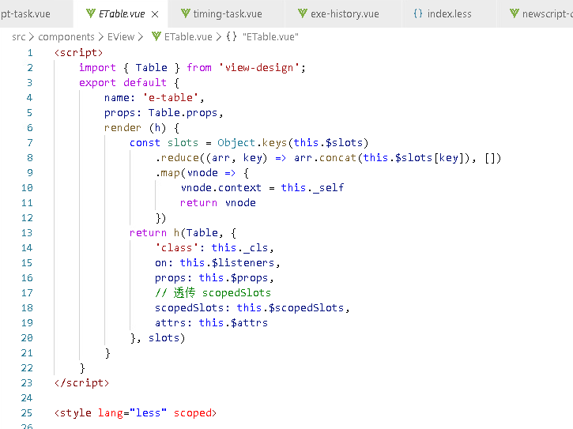

## VUE官方文档
- [vue2](https://cn.vuejs.org/v2/guide/installation.html)
  - [相关版本](https://github.com/vuejs/vue/tags)
- [vue3](https://v3.cn.vuejs.org/guide/introduction.html)
  - [相关版本](https://github.com/vuejs/vue-next/tags)
  - [Vue3的新功能](https://v3.cn.vuejs.org/guide/migration/introduction.html)

## 基础用法（用CDN引入的方式进行简单说明）
### 模板

```html
<!DOCTYPE html>
<html>
<head>
  <meta charset="utf-8">
  <title>VUE</title>
  <script src="https://unpkg.com/vue@3.2.0"></script>
  <script src="https://unpkg.com/vue-router@3.0.0/dist/vue-router.js"></script>
</head>
<body>
  <div id="app">
    <!-- 实例DOM内部 -->
    <div :title="computedTime">
      {{ binding }}
    </div>
  </div>
<script>
  // 实例配置
  const App = {
    // 数据属性，数据绑定后可实现响应式变化
    data() {
      return {
        binding: '数据可绑定到：文本插值{{binding}}、元素属性:title'
      }
    },
    // 计算属性，用法和数据属性类似，可进行数据绑定，适合逻辑较复杂的数据，可以设置getter和setter
    computed: {
      computedTime() {
        // 当依赖的数据属性发生变化时，会重新求值
        return this.binding + 'OnLoad Time：' + new Date().toLocaleString();
      }
    },
    // 侦听器，监听数据变化，做出相应操作。例如数据库类型发生变化时需要重新获取页面数据，就适合监听表示数据库类型的变量
    watch: {

    },
    // 生命周期，在实例创建、挂载、注销等时机进行相关操作
    create() {

    },
    // 函数声明
    methods: {
      showData() {
        console.log(this.binding);
      }
    }
  }
  // 创建实例并挂载到DOM
  const myVue = Vue.createApp(App).mount('#app');
  console.log('myVue.$data为：\n', myVue.$data);
</script>
</body>
</html>
```

### 以下的内容并不完整，建议后续完善

### 事件处理
- 示例代码：

```html
<!-- 在实例DOM内部添加 -->
<div>
  <p>{{ message }}</p>
  <button @click="reverseMessage">反转 Message</button>
</div>

<!-- 在数据属性内添加 -->
message: 'Hello Vue.js!'

<!-- 在函数声明内添加 -->
reverseMessage() {
  this.message = this.message.split('').reverse().join('');
}
```
- 通过点击按钮，触发事件，调用函数，反转文字

### 表单绑定
- 示例代码：

```html
<!-- 在实例DOM内部添加 -->
<input v-model="searchText" />

<!-- 在数据属性内添加 -->
searchText: 'Hello Vue!'
```

- `<input v-model="searchText" />`实际上相当于`<input :value="searchText" @input="searchText = $event.target.value" />`
- 修改输入框的内容，searchText的值也会同步发生变化

### 条件渲染
- 示例代码：

```html
<!-- 在实例DOM内部添加 -->
<span v-if="seen">现在你看到我了</span>
<span v-else> Now you don't </span>
<!-- 在数据属性内添加 -->
seen: true
```

### 列表渲染

- 示例代码：

```html
<!-- 在实例DOM内部添加 -->
<!-- 支持整数（结果为从1到n）、数组与对象遍历 -->
<div>
  <span v-for="n in 10" :key="n">{{ n }} </span>
  <ul>
    <li v-for="item in myArr" :key="item.text">
      {{ item.text }}
    </li>
  </ul>
  <ul>
    <li v-for="value in myObject" :key="value">
      {{ value }}
    </li>
  </ul>
</div>

<!-- 在数据属性内添加 -->
myArr: [
  { text: 'Learn JavaScript' },
  { text: 'Learn Vue' },
  { text: 'Build something awesome' }
]
myObject: {
  title: 'How to do lists in Vue',
  author: 'Jane Doe',
  publishedAt: '2016-04-10'
}
```

### Class 与 Style 绑定
- Class示例代码：

```html
<!-- 在实例DOM内部添加 -->
<div class="static" :class="computedClass" ></div>

<!-- 在计算属性内添加 -->
computedClass() {
  return {
    // 通过计算，确定是否把active和text-danger添加到class中
    active: this.isActive && !this.error,
    'text-danger': this.error && this.error.type === 'fatal'
  }
}
```
- Style示例代码：

```html
<!-- 在实例DOM内部添加 -->
<div :style="{backgroundColor: myColor[status]}" ></div>

<!-- 在数据属性内添加 -->
status: 'success',
myColor: {
  success: 'green',
  error: 'red'
}
```

```html
<!-- 在实例DOM内部添加 -->
<div :style="computedStyle" ></div>

<!-- 在计算属性内添加 -->
<!-- 在 :style 中使用需要浏览器引擎前缀的 CSS property 时，Vue 将自动侦测并添加相应的前缀 -->
computedStyle() {
  return {
    color: this.themeColor,
    fontSize: '16px'
  }
}
```

### 防抖与节流
- 教程：https://v3.cn.vuejs.org/guide/data-methods.html#%E9%98%B2%E6%8A%96%E5%92%8C%E8%8A%82%E6%B5%81

### 修饰符
- prevent `@submit.prevent="onSubmit"`

### 其他
- v-once
- v-html
- 动态指令参数：`<a :[attributeName]="title or id"> ... </a>`或`<a @[eventName]="click or submit"> ... </a>`
- Data Property：创建Vue实例并mount后可以赋值给一个变量，例如上面的myVue，然后访问myVue来查看相关的内置属性和方法
  - $data：访问myVue.$data.binding可以访问数据属性，可以简写为myVue.binding
  - 通过myVue.showData();调用方法

### 注意点

```markup
1、有些元素，诸如 <ul>、<table> 和 <select>，对于哪些元素可以出现在其内部是有严格限制的。这会导致遇到一些问题。
  例如：<table> <blog-post-row></blog-post-row> </table>
  自定义组件 <blog-post-row> 会被作为无效的内容提升到外部，并导致最终渲染结果出错。
  v-is指令解决该问题：<table> <tr v-is="'blog-post-row'"></tr> </table>
2、绑定字符串常量需要加引号，例如:label="1"会解释为数字，:disabled="true"会解释为布尔，需要:label="'1'"才解释为字符串
```

## 组件开发

### 全家桶：VUE@CLI、VUEX、Vue Test Utils for Vue 3、浏览器扩展、Vite
- 按照[VUE@CLI官方文档](https://cli.vuejs.org/zh/guide/)安装VUE@CLI
-  *拓展：还可以尝试[Vite](https://v3.cn.vuejs.org/guide/installation.html#vite)
- 新建一个项目文件夹，打开该目录的cmd，`vue create vue3demo`
- 选择vue3，按提示操作，直到`npm run serve`部署并访问网址
- 添加vue-router与vuex：`npm install vue-router@4 vuex@next --save`
- Vue-cli天生支持less等预处理器，无需webpack配置，如果创建项目忘记选择，可以手动安装（注意版本问题）：`npm i less@2.7.3 less-loader@6.0.0 --save`
- 在根目录添加[vue.config.js](https://cli.vuejs.org/zh/config/#vue-config-js)

```javascript
// vue.config.js
module.exports = {

  // publicPath，相当于webpack的output.publicPath。默认情况下，Vue CLI 会假设你的应用是被部署在一个域名的根路径上，例如 https://www.my-app.com/。如果应用被部署在一个子路径上，你就需要用这个选项指定这个子路径。例如，如果你的应用被部署在 https://www.my-app.com/my-app/，则设置 publicPath 为 /my-app/
  publicPath: process.env.NODE_ENV === 'production' ? '/my-app/' : '/',

  // outputDir，相当于webpack 的 output.path。当运行 vue-cli-service build 时生成的生产环境构建文件的目录（默认值为'dist'）。注意目标目录在构建之前会被清除 (构建时传入 --no-clean 可关闭该行为)。
  outputDir: 'dist',

  // assetsDir，放置生成的静态资源 (js、css、img、fonts) 的目录（相对于 outputDir，默认值为''）。从生成的资源覆写 filename 或 chunkFilename 时，assetsDir 会被忽略。
  assetsDir: '',

  // indexPath，指定生成的 index.html 的输出路径 (相对于 outputDir)。也可以是一个绝对路径。
  indexPath: 'index.html',

  // filenameHashing，默认情况下，生成的静态资源在它们的文件名中包含了 hash 以便更好的控制缓存。
  filenameHashing: true,

  // lintOnSave，这个值会在 @vue/cli-plugin-eslint 被安装之后生效。规定是否通过 eslint-loader 在每次保存时 lint 代码。推荐生产构建时禁用 eslint-loader，开发环境下仅输出警告而不导致编译错误。
  lintOnSave: process.env.NODE_ENV === 'production' ? false : 'warning',


  // 暂时不需要改的属性：
  // runtimeCompiler，是否使用包含运行时编译器的 Vue 构建版本。默认false。
  // pages，在 multi-page 模式下构建应用。默认undefined
  // transpileDependencies，默认情况下 babel-loader 会忽略所有 node_modules 中的文件。。默认[]
  // productionSourceMap，如果你不需要生产环境的 source map，可以将其设置为 false 以加速生产环境构建。默认true
  // crossorigin，设置生成的 HTML 中 <link rel="stylesheet"> 和 <script> 标签的 crossorigin 属性。仅影响由 html-webpack-plugin 在构建时注入的标签 - 直接写在模版 (public/index.html) 中的标签不受影响。默认undefined
  // integrity，在生成的 HTML 中的 <link rel="stylesheet"> 和 <script> 标签上启用 Subresource Integrity (SRI)。如果你构建后的文件是部署在 CDN 上的，启用该选项可以提供额外的安全性。
  // configureWebpack，在VUE中调整 webpack 配置的简单方法
  // chainWebpack，在VUE中调整 webpack 配置的高级方法
}
```

### 组件注册
- 全局注册：在main.js中

```javascript
import { createApp } from 'vue'
import App from './App.vue'
import globalComponent from '@/components/globalComponent.vue'

const app = createApp(App);
// 定义一个名为 global-component 的新全局组件
app.component('global-component', globalComponent)
app.mount('#app');
```

- 局部注册：在.vue文件中import，并在components中注册

```html
import Template from './components/template.vue'

export default {
  name: 'App',
  components: {
    Template
  },
}
```

### 父子组件交互
- 父组件通过 Prop 向子组件传递数据
  - type可以是String,Number,Boolean,Array,Object,Function,Promise,Symbol
  - 单向数据流：父级 prop 的更新会向下流动到子组件中，但是反过来则不行。所以，通常父级prop传到子组件后会赋值给新的变量
  - Prop 验证：type类型、default默认值(数组和对象需要从工厂函数中获取)、validator验证
  - 虽然HTML 中的 attribute 名是大小写不敏感的，但是单文件组件template中传递prop使用驼峰命名也可以。父组件传递函数时同理。

```html
<!-- 父组件向子组件传递数据 -->
<Template ref="childTemplate" :data="myData" string="myString" :index="123" />

<!-- 子组件使用props获取数据 -->
export default {
  name: 'child',
  props: {
      data: { type: Object, default() { return {} }, required: true },
      string: { type: String, default: ''},
      index: {
        type: Number,
        validator(value) {
          // 需要大于 0
          return value > 0
        }
      }
  },
  data() {
    return {
      childData: Json.parse(Json.stringify(this.data))
    }
  }
  created() {
    console.log(this.data);
  }
}
```

- 父组件通过 @函数名 向子组件传递函数：

```html
<!-- 父组件向子组件传递函数 -->
<Template @fatherMethod="fatherMethod"/>

methods: {
  fatherMethod(val) {
    console.log('调用父组件方法:', val);
  }
}

<!-- 子组件通过$emit使用父组件的函数 -->
  <!-- emits中加上父组件的函数 -->
  export default {
    name: 'child',
    props: ['title', 'string'],
    emits: ['fatherMethod'],
    mounted() {
      this.$emit('fatherMethod', 'childVal')
    },
  }
```

- 父组件使用子组件的函数
  - $refs 只会在组件渲染完成之后生效。应该避免在模板或计算属性中访问 $refs。

```html
<!-- 父组件中的子组件设置ref -->
<Template ref="childTemplate" :data="myData" string="" :index="123" />
mounted() {
  console.log('调用子组件方法:', this.$refs['childTemplate'].showText());
}

<!-- 子组件中的函数 -->
methods: {
  showText() {
    return this.greeting;
  }
}
```

- 父组件通过v-model绑定子组件中的表单元素（双向数据流）：https://v3.cn.vuejs.org/guide/component-custom-events.html#v-model-%E5%8F%82%E6%95%B0


### Provide / Inject
- 当组件深度嵌套，底层子组件要用到上层父组件的数据，需要沿着组件链逐级传递，会比较麻烦，所以要通过Provide / Inject实现。
-  *把父组件的数据放到vuex也能解决该问题

```html
<!-- 上层父组件provide -->
data() {
  return {
    todos: ['Feed a cat', 'Buy tickets']
  }
},
provide() {
  return {
    todoLength: this.todos.length
    // 上述写法非响应式，如果父组件的provide数据发生变化也不会反应到子组件，如果需要响应式变化，那就用下列的写法
    // todoLength: Vue.computed(() => this.todos.length)
  }
},
<!-- 底层子组件inject --> 
inject: ['user'],
created() {
  console.log(`Injected property: ${this.user}`) // > 注入 property: John Doe
}
```

### 插槽
- https://v3.cn.vuejs.org/guide/component-slots.html
- 具名插槽、作用域插槽

### 动态组件
- 组件撤销后，又回到该组件时，通常会重新渲染成初始状态，撤销前的状态会丢失，如果想要让组件保持撤销前的状态，需要用动态组件。

```html
<!-- 在动态组件外面包一层keep-alive即可 -->
<keep-alive>
  <component :is="currentTabComponent"></component>
</keep-alive>
```

### 异步组件
- 当想要按需引入组件的时候，可以使用[异步组件](https://v3.cn.vuejs.org/guide/component-dynamic-async.html#%E5%BC%82%E6%AD%A5%E7%BB%84%E4%BB%B6)

### 组件更新
- this.$forceUpdate();
- v-if="seen"
- :key="freshKey"
- this.$nextTick(() => {})

## 过渡/动画
- [抖动、色彩渐变、按钮激活、弹球](https://v3.cn.vuejs.org/guide/transitions-overview.html)
- [动态状态过渡](https://v3.cn.vuejs.org/guide/transitions-state.html#%E5%8A%A8%E6%80%81%E7%8A%B6%E6%80%81%E8%BF%87%E6%B8%A1)
- [交互动画](https://v3.cn.vuejs.org/guide/transitions-state.html#%E6%8A%8A%E8%BF%87%E6%B8%A1%E6%94%BE%E5%88%B0%E7%BB%84%E4%BB%B6%E9%87%8C)

## 可复用&组合
- 需要评估复用效率与学习成本、代码易读性。当然，学习阶段可以无视这些多用用。

### 组合式API
- [组合式API](https://v3.cn.vuejs.org/guide/composition-api-introduction.html)：当应用变得非常大的时候，某个组件使用 (data、computed、生命周期、provide/inject、methods、watch) 组件选项来组织逻辑的方式会变得十分混乱，为了理清逻辑需要经常跳转于各个逻辑代码块之间，特别是对开始没有编写这些组件的人来说，这会导致组件难以阅读和理解。组合式API就是可以将上述组件选项组合起来放在setup()中，让逻辑代码变得更加清晰有条理的功能。

### Mixin
- 当组件使用 mixin 对象时，所有 mixin 对象的选项将被“混合”进入该组件本身的选项。例如表格根据高度计算分页数量的逻辑可以抽象成mixin，混入各个表格组件中。
- 包括全局和局部mixin。如果组合式API熟练的话，会比mixin更加强大，但是mixin会更加简单。vuex、绑定全局方法到Vue.prototype一定程度上也能实现mixin的功能

### 自定义指令
- https://v3.cn.vuejs.org/guide/custom-directive.html
- 某些情况下，例如所有组件自动聚焦其中的输入框，表格列支持拖拽等，适合用自定义指令实现，包括全局和局部指令。
- 自定义指令里面可以使用：钩子函数、动态指令参数

### Teleport
- 当组件模板的一部分逻辑上属于该组件，而从技术角度来看，最好将模板的部分HTML移动到 DOM 中的其他位置。例如，某个组件的按钮可以打开全屏弹窗，该全屏弹窗的父级元素最好是body（方便定位），而不是深层嵌套后的组件div，这时候就合适用Teleport。

```html
<!-- 注册全局指令 -->
// 注册一个全局自定义指令 `v-focus`
app.directive('focus', {
  // 当被绑定的元素挂载到 DOM 中时……
  mounted(el) {
    // 聚焦元素
    el.focus()
  }
})

<!-- 组件中注册局部指令v-focus -->
directives: {
  focus: {
    // 指令的定义
    mounted(el) {
      el.focus()
    }
  }
}

<!-- 模板中元素上使用新的 v-focus -->
<input v-focus />

```

### 渲染函数&函数式组件
- 使用render()可以代替template的书写，通过逻辑生成HTML，适合频繁使用且逻辑复杂的组件，例如高阶表格组件。
- render()的用法：https://v3.cn.vuejs.org/guide/render-function.html
  


### 插件
- 使用第三方插件可以快速扩展应用的功能，[awesome-vue](https://github.com/vuejs/awesome-vue#components--libraries)集合了大量由社区贡献的插件和库。其他好用的插件需要探索和积累，可以多搜索多尝试。
- [自行编写插件](https://v3.cn.vuejs.org/guide/plugins.html)

## 相关原理
- https://v3.cn.vuejs.org/guide/web-components.html
- Vue组件 与 原生的自定义组件Web Components
- 响应式原理
- 渲染机制与优化


## 工具

### 测试
- 

### TypeScript支持
- https://v3.cn.vuejs.org/guide/typescript-support.html
- TypeScript可以帮助防止许多潜在的运行时错误，这就是为什么 Vue 3 是用 TypeScript 编写的。所以Vue3原生支持TypeScript。

### 移动端
- https://v3.cn.vuejs.org/guide/mobile.html
- 虽然 Vue.js 本身并不支持移动应用开发，但是有很多解决方案可以用 Vue.js 创建原生 iOS 和 Android 应用。

### 服务端渲染
- https://v3.cn.vuejs.org/guide/ssr.html
- SSR主要的好处：更好的搜索引擎优化（预渲染也可以实现）、更快的内容呈现（但也带来了更多的服务器负载）；在应用中使用 SSR 之前，你需要问自己的第一个问题是是否真的需要它。

### 无障碍
- https://v3.cn.vuejs.org/guide/a11y-basics.html

## API参考
- https://v3.cn.vuejs.org/api/global-api.html