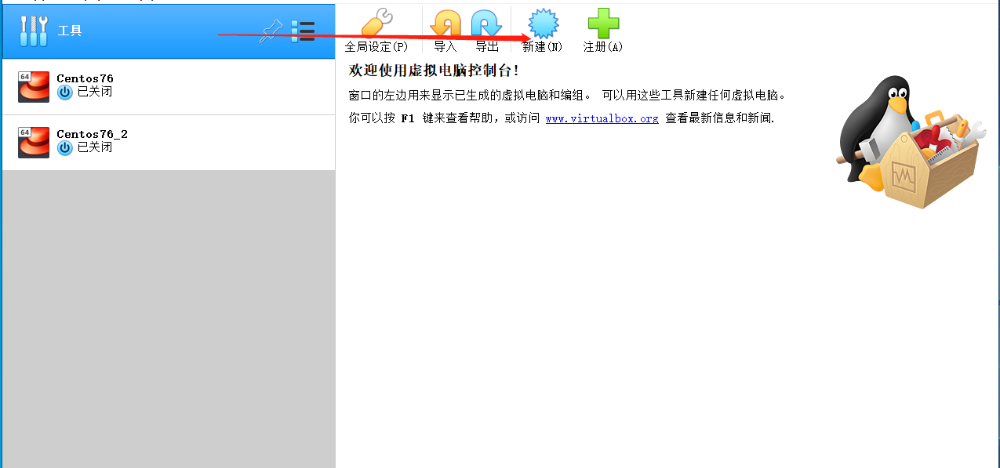
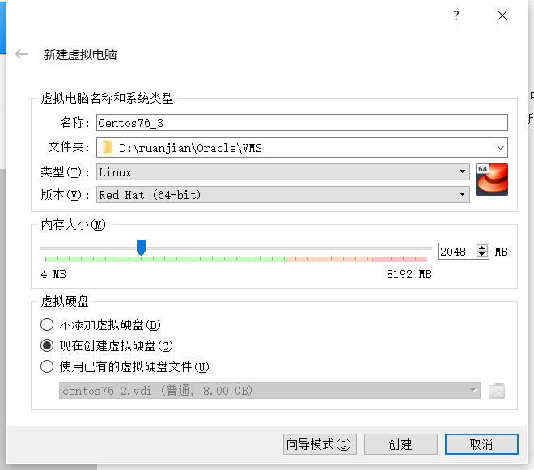
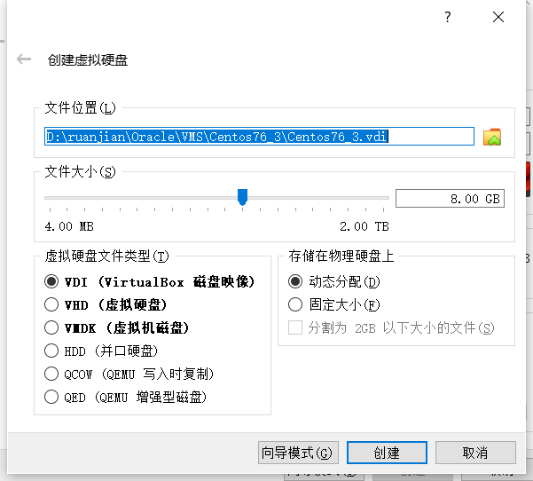
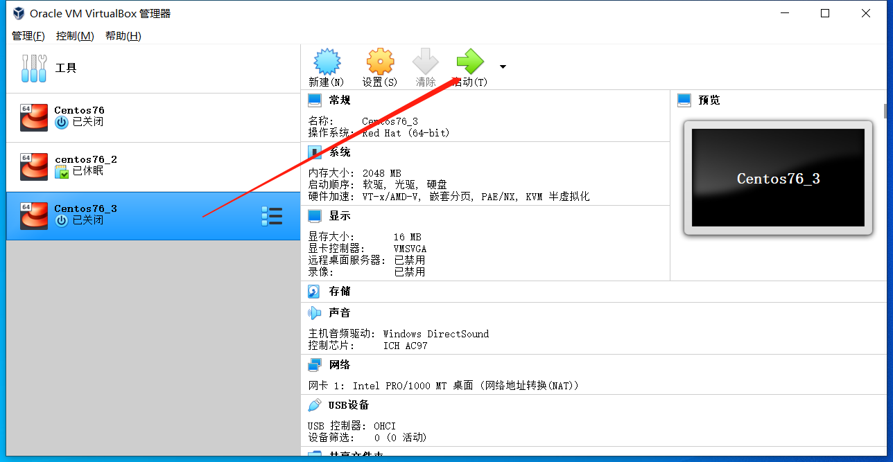
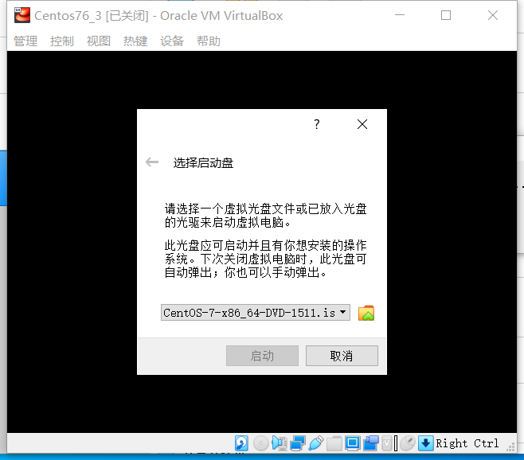
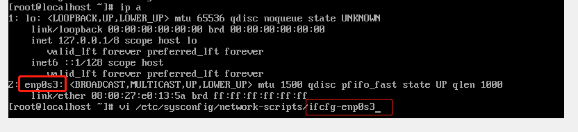
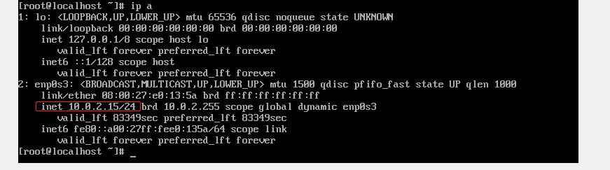
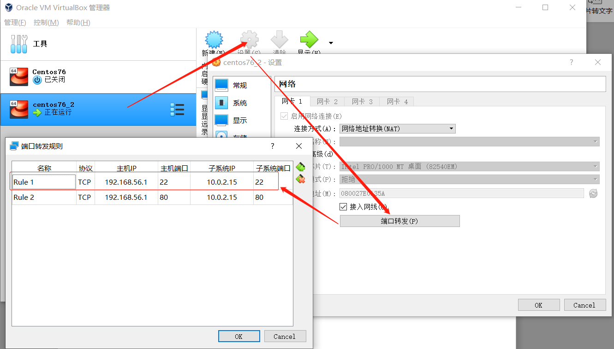
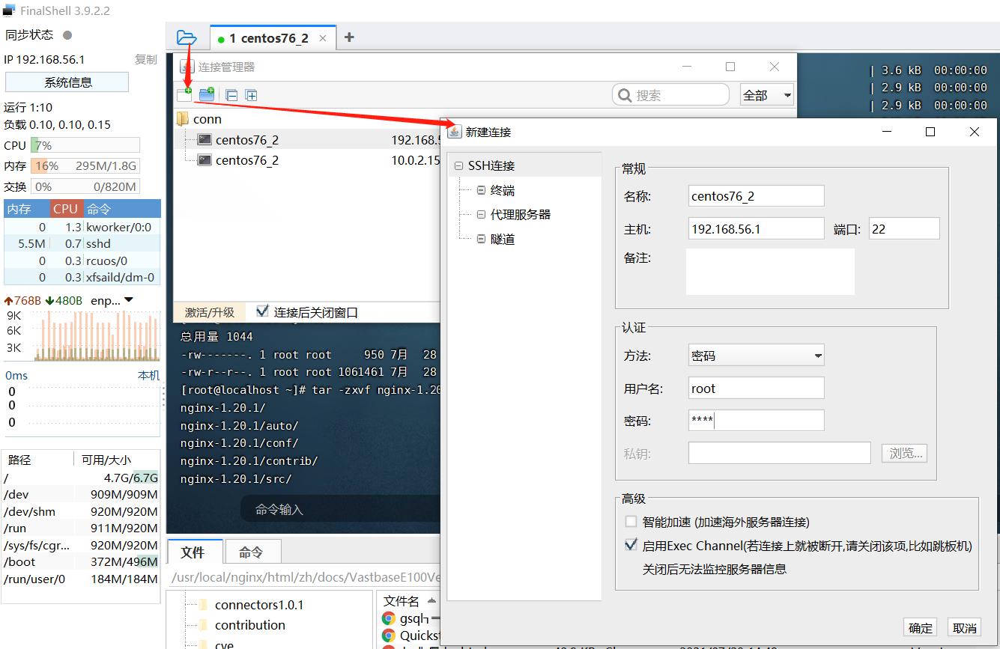
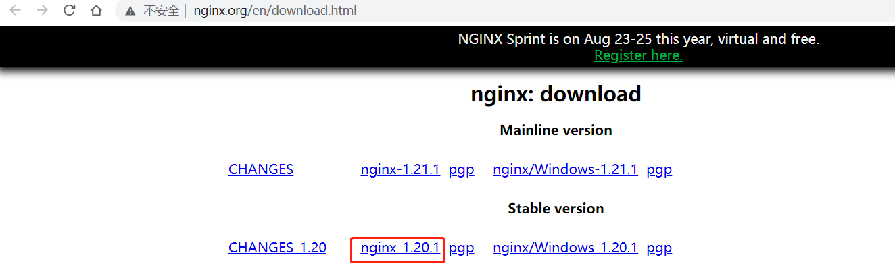

## 常识 ##
- linux是内核，有多个内核版本；在内核基础上添加工具软件形成linux系统，有多个发行版本
- linux发行版：RedHat系列、Debian系列等

  <table style=" border-collapse: collapse;">
    <tr>
      <td>Centos</td>
      <td>Ubuntu</td>
    </tr>
    <tr>
      <td>基于RedHat Enterprise Linux开源而来</td>
      <td>基于Debian加强而来</td>
    </tr>
    <tr>
      <td>使用yum包管理器安装的.rpm包</td>
      <td>使用apt-get包管理器安装的.deb包</td>
    </tr>
    <tr>
      <td>常用作服务器</td>
      <td>常用作个人桌面</td>
    </tr>
      <td>常用版本：7.6</td>
      <td>常用版本：16.04</td>
    </tr>
  </table>

- Linux系统组处：linux内核、shell（用户与内核交互的接口）、文件系统、第三方应用
- bash是大多数Linux系统的默认shell版本

## WINDOWS使用VirtualBox安装Centos7并配置SSH连接 ##

- [安装VirtualBox](https://www.virtualbox.org/)
- [下载镜像:CentOS-7-x86_64-DVD-2009.iso ](http://mirrors.aliyun.com/centos/7/isos/x86_64/)
- 打开VirtualBox，新建虚拟机











- 按指引安装好centos，然后进入命令行，配置网络文件，把里面的ONBOOT设置为yes，然后`service network restart`



- `ip a`查看子系统ip



- 设置端口转发，本机ip为本地ipconfig的结果



- SSH工具连接，成功连接即可



## Centos7安装配置nginx ##

可以更改yum源然后`yum install nginx`或源码安装nginx，下面展示源码安装过程

- [下载nginx源码包](http://nginx.org/en/download.html)



- 把源码包放到合适路径，资源管理器进入该路径，按住shift + 右键 -> 在此处打开powershell窗口 -> 命令行
- 把源码包传到centos下的root目录 `scp .\nginx-1.20.1.tar.gz root@192.168.56.1:/root`
- SSH连接centos，先安装gcc，再把nginx安装到`/usr/local/nginx`下

```markup
# 配置nginx需要先安装gcc
yum install gcc

# 转到root目录，解压nginx源码包
cd /root
tar -zxvf nginx-1.20.1.tar.gz

# 转到源码目录，配置nginx路径为/usr/local/nginx，编译安装
cd nginx-1.20.1
./configure --prefix=/usr/local/nginx --without-http_rewrite_module --without-http_gzip_module
make && make install

# 转到nginx路径，设置环境变量，设置nginx启动配置文件，重载nginx
cd /usr/local/nginx/
export PATH=$PATH:/usr/local/nginx/sbin/
nginx  -c /usr/local/nginx/conf/nginx.conf
nginx  -s reload

# 转到nginx路径下html目录，web访问该系统ip:80（我是由虚拟机端口转发而来的192.168.56.1:80），默认打开里面的index.html
cd /usr/local/nginx/html
```

## 上传静态网站，代替默认的nginx页面 ##
- 先把/usr/local/nginx/conf/nginx.conf里面的nginx编码格式改成utf-8
- 让nginx支持省略html的后缀，访问ip/test等同ip/test.html

```
   server {
       listen       80;
       server_name  localhost;
       
       charset utf-8;
	   location / {
			...
		   try_files $uri $uri/ $uri.html?$args;
	   }
   }
```
- 资源管理器进入静态网站public.zip所在路径，按住shift + 右键 -> 在此处打开powershell窗口 -> 命令行
- 把源码包传到centos下的root目录 `scp .\public.zip root@192.168.56.1:/root`
- SSH连接centos服务器

```markup
# 进入root目录，安装解压工具
cd /root
yum -y install unzip

# 设置cp936编码防止中文乱码，解压到nginx目录
unzip -O cp936 public.zip -d /usr/local/nginx/html
# 转入public文件夹，将里面的内容放到外层的html文件夹，返回外层html文件夹，删除空的public文件夹
cd public
mv * ../
cd ..
rm -rf public
```

## 配置nginx自启动 ##

- 将nginx添加到系统服务中

```markup
cd /lib/systemd/system/
vi nginx.service
```

- 配置nginx系统服务文件`nginx.service`

```markup
[Unit]
Description=nginx service
After=network.target 
   
[Service] 
Type=forking 
ExecStart=/usr/local/nginx/sbin/nginx -c /usr/local/nginx/conf/nginx.conf
ExecReload=/usr/local/nginx/sbin/nginx -s reload
ExecStop=/usr/local/nginx/sbin/nginx -s quit
PrivateTmp=true 
   
[Install] 
WantedBy=multi-user.target
```

- 重载系统服务`systemctl daemon-reload`
- 设置nginx服务开机启动`systemctl enable nginx`
- 更多操作

```markup
# systemctl start nginx　         启动nginx服务

# systemctl stop nginx          停止服务

# systemctl restart nginx       重新启动服务

# systemctl list-units --type=service     查看所有已启动的服务

# systemctl status nginx       查看服务当前状态

# systemctl enable nginx         设置开机自启动

# systemctl disable nginx        停止开机自启动
```


## Linux命令 ##

[参考资料](https://mp.weixin.qq.com/s?__biz=MzI4Njg5MDA5NA==&mid=2247484231&idx=1&sn=4cf217a4d692a7aba804e5d96186b15b&chksm=ebd74246dca0cb5024de2f1d9f9e2ecb631e49752713c25bbe44f44856e919df5a973049c189&scene=21#wechat_redirect)

### Linux目录结构 ###

从根目录`/`开始

- bin 存放二进制可执行文件(ls,cat,mkdir等)
- boot 存放用于系统引导时使用的文件
- dev 存放设备文件
- etc 存放系统配置文件
- home 存放用户文件
- lib 存放跟文件系统中程序运行所需要的共享库及内核模块
- mnt 系统管理员安装临时文件系统的安装点
- opt 额外安装的可选应用程序包所放置的位置
- proc 虚拟文件系统，存放当前内存的映射
- root 超级用户目录
- sbin 存放二进制可执行文件，只有root才能访问
- tmp 存放各种临时文件
- usr 存放系统应用程序，其中`/usr/local`为本地管理员软件安装目录
- var 存放运行时需要改变数据的文件

用户目录`~`，默认是root目录

### 命令基础 ###

`cmd [options] [arguments]`

- 命令区分大小写
- tab提示补全
- 上下箭头查看历史命令
- 别名alias（例如rm默认使用-rf参数） `alias rm='rm -rf'`
- 空格间隔（例如同时删除多个指定的目录和文件） `rm -rf test index.bak index.html `
- 支持正则

### 常用命令 ###
- 查看历史命令 `history`
- 查看当前目录 `pwd`
- 切换目录 `cd /usr/local`
	- 切换到上一级目录 `cd ..`
	- 切换到当前目录下的local目录 `cd ./local` 或 `cd loacl`
	- 切换到cd跳转目录前所在的目录`cd -`
- 显示当前目录下文件信息 `ll`
	- 显示当前目录下文件信息 `ll /usr/local`
	- 只显示文件名 `把ll改成ls`
	- 列出指定目录下的所有以w开头的文件或目录 `ls  /usr/bin/w*`
- 查看文件详细信息 `stat test.md`
- 新建
	- 新建文件夹 `mkdir -p /tmp/a/b/c`
	- 新建文件 `touch test.html`
- 删除指定文件或文件夹 `rm -rf xxx`
	- 删除该目录下所有文件 `rm -rf *`
- 剪切文件
	- 把该目录下所有文件放到上一级目录 `mv * ../`
	- 改名文件 `mv index.html index.bak`
- 复制文件 `cp /root/index.html /usr/test/index.bak`
	- 将指定目录下所有文件复制到当前目录 `cp -r /root/public/* .`
- 在当前目录下查找文件 `find -name xxx`
	- 在指定目录下查找文件 `find /tmp/test -name xxx`
- 查看或编辑文件 `vi index.html`
	- 查看文件头10行 `head -10 test.html`
	- 查看文件尾10行 `tail -10 test.html`
- 重定向
	- 把左边的输出放到右边的文件（有则覆盖，无则创建）里去 `echo "my content" > test.txt`
	- 把左边的输出追加到右边的文件（有则追加，无则创建）里去 `echo "my content" >> test.txt`
- 管道
	- 将前面命令的结果给后面的命令（将ll的结果加入wc统计字数） `ll | wc`
- linux自带解压（将nginx源码包解压到当前目录，v代表输出过程） `tar -xvf nginx-1.20.1.tar.gz `
- linux自带压缩（将当前目录的文件压缩成public.tar.gz） `tar -cvf public.tar.gz *`
- centos自带包管理 `yum -y install xxx`
- 检测网络连通性 `ping ip或www.baidu.com`
- 系统服务（例如防火墙）
	- 防火墙状态 `systemctl status firewalld.service`
	- 关闭防火墙 `systemctl stop firewalld.service`
	- 禁用防火墙 `systemctl disable firewalld.service`
- 进程（例如nginx）
	- 查看nginx进程号 `ps -ef | grep nginx`
	- 结束进程 `kill -9 进程号`
- shell环境变量：略
- vi编辑器
	- 进入 `vi filename`
	- 普通模式：默认，或其他模式按esc
		- G 跳到文件尾
		- ZZ 保存退出
		- ZQ 不保存退出
		- ? str 查找字符串str
		- n 继续查找下一个
		- yy 复制一行
		- p 粘贴在下一行
		- dd 删除一行
		- u 取消上一次操作
	- 插入模式：按下insert
	- 命令行模式：按下冒号:
		- wq 保存退出
		- q! 不保存退出